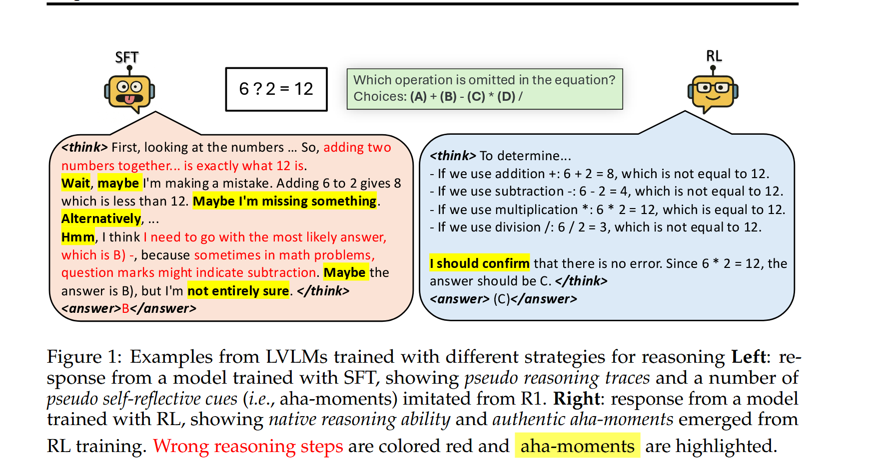
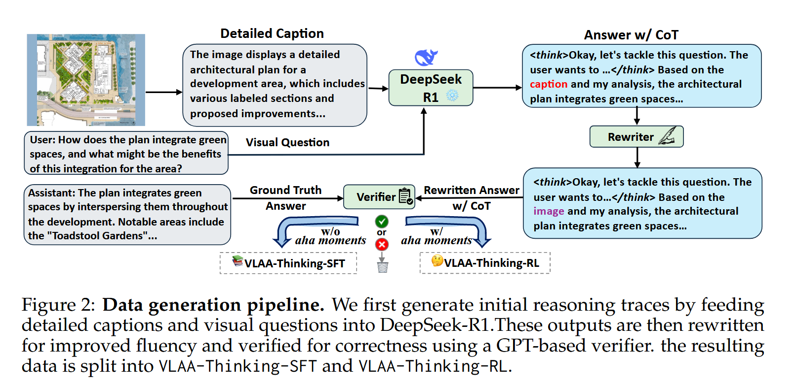
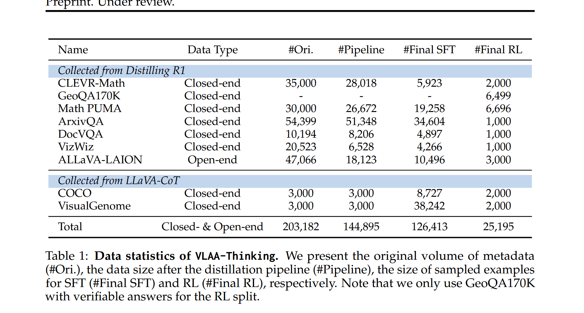
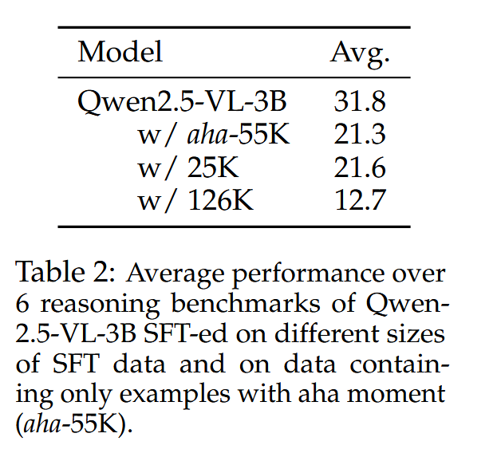
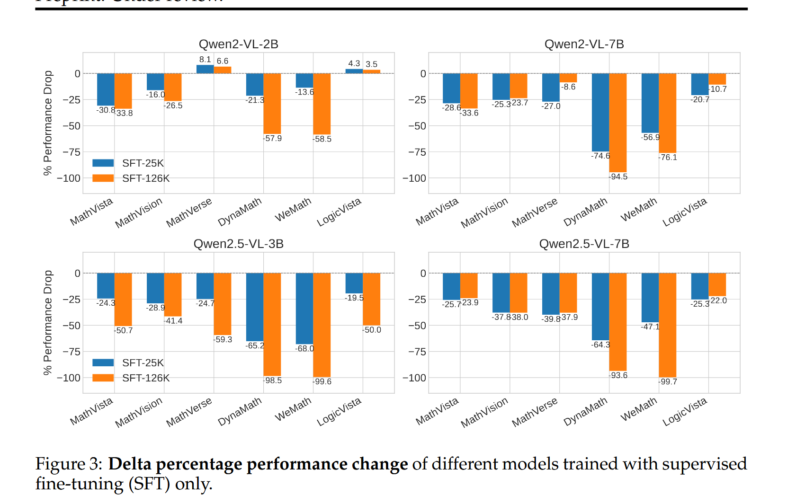
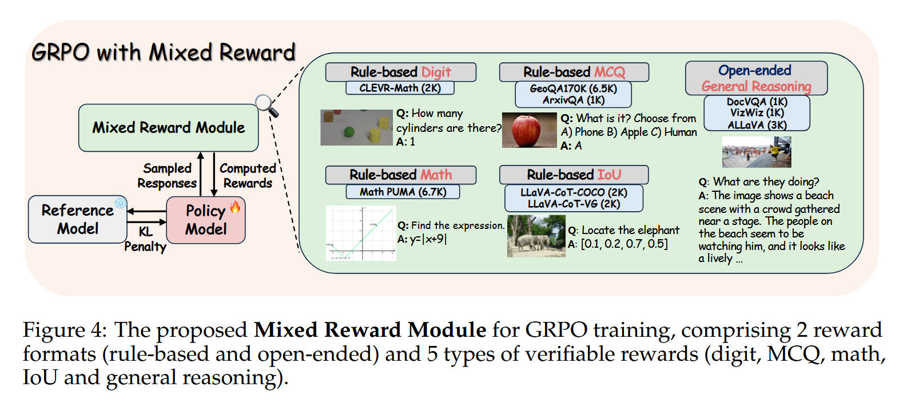
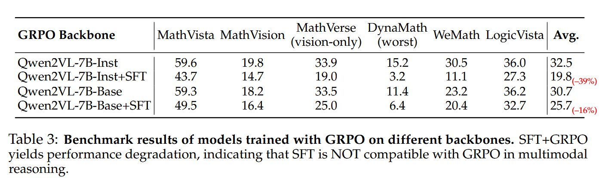
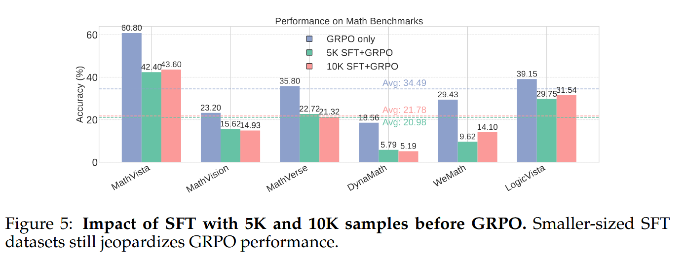
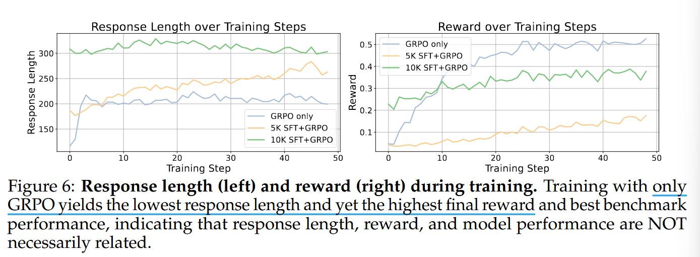
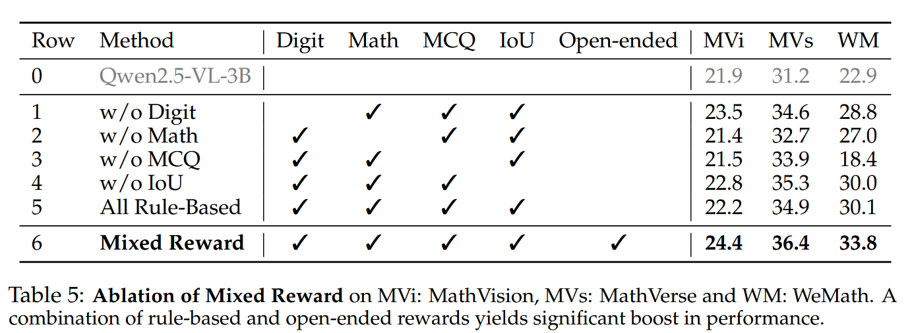

# SFT or RL? An Early Investigation into Training R1-Like Reasoning Large Vision-Language Models

## Introduction

### What problem does this paper mainly address ?

- 在 LLMs 中赋予模型推理能力的方法是否同样适用于 LVLMs，方法即先对推理数据进行监督微调（SFT），再进行强化学习（RL）

- 具体地说，探讨在多模态推理中 SFT 和 RL 的区别是什么以及这种两阶段范式对于 LVLMs 的推理是否必要

### How does the paper address the above challenges ?

- 创建了 VLAA-Thinking 数据集，图像-文本推理数据集，明确设置用于支持 SFT 和 RL

- 使用 VLAA-Thinking 数据集消融研究 SFT, RL, their conbinations 在多模态推理中作用，具体来讲，系统研究 SFT 数据类型、数据集规模、模型容量对 SFT 作用影响，对 RL（以 GRPO 为例）研究不同奖励函数、基本模型影响以及 SFT 和 GRPO 相互作用的影响

### What are the main conclusions of this paper ?

- 探讨了 SFT 和 RL 在多模态推理中的贡献，SFT 在基本模型上提高了标准任务的性能，但不能增强模型在复杂推理方面的能力，仅通过 SFT 模型推理会产生 “伪推理路径”

- 对 GRPO 中 rule-based rewards，数学和多项选择比其他奖励更有益，而基于规则和开放式奖励的集合产生了更好的表现

- 在 GRPO 之前进行 SFT 会损害对齐模型（aligned model）的性能，且较大模型也无法避免 SFT 带来的退化

- 通过考察训练过程，发现反应长度（response length）、奖励和模型表现相关性很小，sft-ed model 获得更高的初始奖励和更长的反应，但表现不如强化学习训练的模型，与之前认为的更好的模型通常会产生更长的回答和更高的强化学习奖励形成对比

- 总的来讲，SFT 帮助未对齐模型遵循指令，但限制了 RL 过程中的探索。相比之下，直接从奖励信号中学习可以产生更有效和适应性的思维行为

## The VLAA-Thinking Dataset

VLAA-Thinking 数据集由两部分组成：

- VLAA-Thinking-SFT，捕获基于 SFT 视觉输入的逐步推理

- VLAA-Thinking-RL，包含专门为 RL 设计的具有挑战性的样本

Data generation pipeline 旨在通过结构化的多阶段过程将推理能力从强大的纯文本模型转移到多模态领域。整个 pipeline 由六个关键部分组成。

Metadata Collection ---> Visual Input and Additional Information ---> Reansoning Answer Distillation ---> Answering and Rewriting ---> Atuomated Verfication ---> Curating Splits for SFT and RL

按照上述步骤，数据集遵循 {图像、问题、推理、答案} 的格式，推理和答案由 DeepSeek-R1 生成，SFT 有 126,413 个样本，RL 有 25，195 个样本。

> 个人小疑问：在 #6: Curating Splits for SFT and RL 中，为 RL 挑选更具挑战性的样本（通过 self-reflective cues 来判断），对 SFT-split。排除带有 aha moment 的样本，因为过于复杂使得模型无法模仿。这是否不太公平？

## Investigating The Role of SFT for Multimodal Reasoning

研究发现，SFT 中的 self-reflection thinking ("aha moments") 充斥着过度和不相关的推理，成为 “伪顿悟时刻 (pseudo aha moments)” 并损害性能。

该部分探索：

- model perform when SFT-ed on data with aha-moments

- the effect of SFT data size to model performance

### Experiment Setup

在构造的 SFT 数据集（共 126K）中，答案中包含 aha-moments 的共计 55k 个样本， 使用 perplexity(PPI) 滤波来获得更小的（25k）更高难度的 SFT 数据集，使用 Qwen2VL(2B and 7B)、Qwen2.5VL(3B and 7B) 进行训练

### Findings

- SFT with Aha Moments Degrades Performance：表明通过 SFT 追求 aha moment 并不可靠，因为 SFT 只是教会模型去模仿，而不是真正的泛化、迁移出真正的自省式推理能力

- More SFT Data, Worse performance：简单的扩大 SFT 数据并不能提高 llm 的泛化推理能力，反而可能抑制模型在各种推理任务上的能力

- Larger Model Are Not Immune to SFT Degeneration：扩大模型尺寸并不能减轻过度 SFT 的不利影响 

## Improving Multimodal Reasoning with Mixed Rewards

### GRPO with Mixed Reward

为让 GRPO 方法更适应多模态推理（结合文本和视觉），除了传统文本奖励外，还引入了视觉特有的奖励类型，提出了一个包含感知和推理的混合奖励框架（mixed reward framework）以全面激励模型在视觉-语言理解上能力。 

该奖励框架包含具有两种格式的五种类型的可验证奖励，包括视觉感知和视觉推理任务。

**rule-based reward** : 

  - digit matching ： 回答来自 CLEVR-Math 的计数问题，答案是一个数字

  - option letter matching：多项选择题

  - math expression matching：要求模型解决一个数学问题，如找到一个函数表达式或圆锥体积，以 latex 格式输出其答案，使用 Math Verify3 包检查正确性

  - Intersection over Union for bounding boxes：提示模型输出图像中对象的边界框坐标，并计算 IoU 分数（范围从 0 到 1）

**open-ended reward** : 使用 InternLM-XComposer2.5-Reward 作为评分器，以图像和 QA 对作为输入，并输出一个奖励分数。分数被正则化到 [0, 1] 以与基于规则的奖励规模一致

**Implicit Format Reward**:

- 以前很多工作（如 DeepSeek-r1）会单独奖励输出格式正确，但这样会让奖励函数复杂，还可能限制模型探索

- 不再单独加格式奖励，而是让格式奖励 “覆盖” 一切，即只要模型输出的内容不能被提取为一个有效的答案，奖励就直接设为0。

- 实验证明，只要提示语写好，模型最终会自己学会格式，不需要额外奖励项

### Effect of SFT on GPRO Training

在多模态推理中，SFT 与 GRPO 并不兼容，且与没有指令跟随功能的基本模型相比，SFT 给指令跟随模型带来了更多的退化。

较小的 SFT 数据集仍然会影响 GRPO 性能。（较小数据集按 PPL 过滤方式，选取 top-5k，top-10k）

GRPO 的反应长度和奖励不是推理能力的可靠指标。有趣的是 SFT-ed model 初始奖励更高，但很快会被 GRPO-only model 超越。因此认为，推理是一种更有可能由 GRPO 发展起来的能力，SFT-ed model 看似在推理但其行为更接近与模式模仿，一种缺乏概括推理技能的伪推理形式。

### GRPO Training without SFT

### Ablations

## Related Work

### Vision-Language Reasoning Models

- Earlier VL methods，such as few-shot prompting and chain-of-thought (VoT)

- Recently, LLaVA-CoT 采用 SFT 方法（4 步结构化输出）来增强模型的推理能力，但由于其输出格式僵化，缺乏灵活性

- More recently, newer models incorporate more natural reasoning traces and reinforcement learning

### Reward Modeling in Reinforcement Learning

## Conclusion

