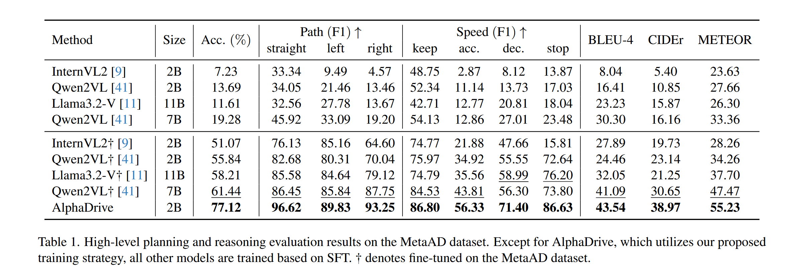
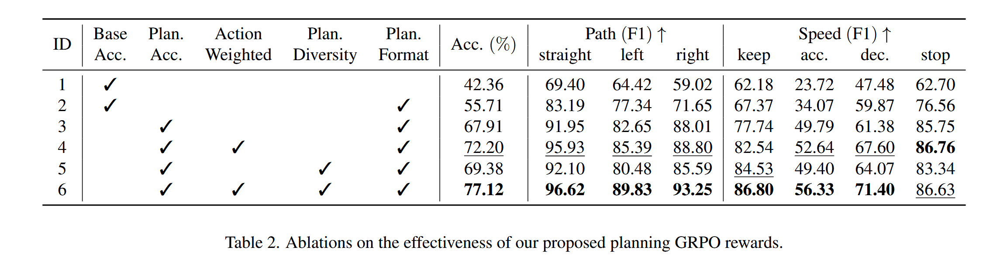
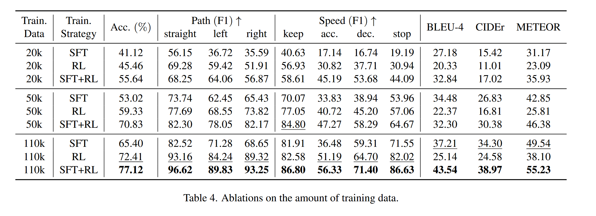
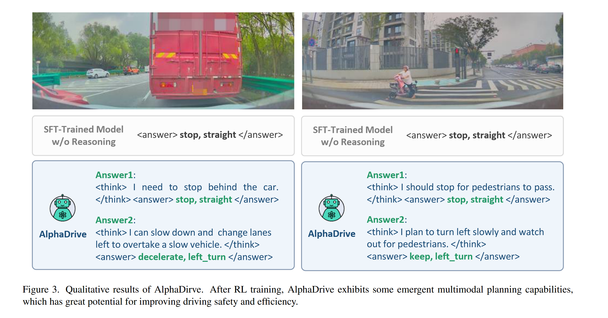

# AlphaDrive: Unleashing the Power of VLMs in Autonomous  Driving via Reinforcement Learning and Reasoning

## Induction 

最近研究将 VLMs 应用到自动驾驶方向 ：

- 利用 VLMs 理解驾驶场景

- 利用 VLMs 进行规划，将 VLMs 看作端到端系统处理输入直接预测轨迹，由于 VLMs 在语言空间建模，本质上不适合精确数值计算

针对 VLMs 不适合精确数值计算的解决方法 ：

- 进行语义层面规划，如：减速并右转

存在问题 ：

- 缺乏对训练方法的进一步探索，仅依赖 SFT，忽略了其他训练策略影响

## Model 

### overview 

#### What is AlphaDrive's core innovation ?

- integrate VLM with RL and reasoning techniques

#### What are AlphaDrive's contributions ?

- four GRPO rewards for planning : planning accuracy reward, action-weighted reward, planning diversity reward, planning format reward.

- a two-stage reasoning training strategy based on knowledge distillation, integrating SFT and RL.

### planning-oriented reinforcement learning

reinforcement learning algorithm : 选择 GRPO

- GRPO 提供更高的训练稳定性和效率，DeepSeek-R1 证明了 GRPO 的有效性

- GRPO 中 group relative optimization strategy 特别适合规划（planning），因为规划常涉及多个有效解决方案，锲合在多个解决方案间进行相对优化

planning reward modeling : 对 speed 和 direction 分别计算 planning_quality_reward，

$$Planning  Quality Reward = Planning Accuracy Reward \times Action Weighted Reward \times Planning Diversity Reward$$

- planning accuracy reward : 采用 F1-score 去评估横向（direction）和纵向（speed）决策准确性
    - 若计算模型输出与真实标签是否完全一致，在模型早期由于模型输出格式不规范导致训练不稳定
 
    - 若检测 ground truth 是否在模型输出的词中，容易导致 mode collapse，（把所有可能的动作都输出一遍）
 
    - 采用 F1-score 既能防止模型学 “投机策略”，又能提高训练早期的稳定性

- action-weighted reward : 不同行为在规划中重要性不同，因此为不同动作分配不同的重要性权重

- planning diversity reward : 观察到早期会生成多个解，后期逐渐收敛到相同解，为鼓励多样性，惩罚输出都相同情形，但最高不超过 20%

- planning format reward : 正则化输出格式来更容易提取推理过程和最终答案，具体来说，reasoning procee 封装在 `<think>/<think>` 中，planning result 封装在 `<answer>/<answer>` 中。若不符合此格式，设为 0。 

### reasoning : distillation from large models 

challenge :

- 缺乏高质量推理数据集 ：自动驾驶中规划过程难以记录，人工标注成本高

- 将推理步骤直接整合进 RL 训练过程效果不理想 ：(1) 对交通信号灯等关键要素认知不足 (2) 推理过程杂乱无章且因果关系较弱 (3) 推理输出过于冗长且无效

solution : 

- 使用 GPT-4o 根据少量驾驶片段生成 “规划推理数据”

- 每个样本是通过提示词（该场景下真实的驾驶动作、车辆当前的状态信息、导航信息）生成的一段简洁的决策推理过程

- 经过人工筛选后进行知识蒸馏

### training : SFT Warm-Up, RL Exploration 

process : 

- 先用少量数据进行 SFT（监督微调）预热训练，让模型先学会基本推理

- 再用整个数据集进行 RL 训练，进一步优化策略

cause : 

- RL 依赖的是稀疏的奖励信号（sparse rewards），SFT 使用密集的监督信号（dense supervision），知识蒸馏中，SFT 更为合适

- 如果只使用 RL，模型在训练初期会非常不稳定

## Experiments 

### experimental setting

Dataset : MetaAD 

- 由 120k driving clips 组成，每个 clip 持续三秒，

- 使用 110k 训练，10k 验证。

- 对于推理，从训练集采样 30k 生成 planning reasoning process。

Training : 

- 使用 Qwen2VL-2B

- 输入包括一张前视图像(a front-view image)和一段规划提示(a planning prompt)，其中包含车辆的当前速度和导航信息。

evaluation : 

- meta-action planning : 计算所有类别的横向和纵向元动作的 F1-score 来衡量，然后计算整体规划精度

- planning reasoning : 计算生成的规划推理过程与数据集中标注的推理过程之间的相似度，使用 BLEU-4，CIDEr 和 METEOR  

> BLEU (Bilingual Evaluation Understudy，双语自动评价指标) : 最初用于评估机器翻译质量，现在广泛用于 “文本生成” 任务的自动评分。
>
>    - 通过计算模型生成文本和真实参考文本之间的 n-gram（连续的 n 个词） 重叠率来打分
>
>    - BLEU-4 就是在指标中使用了 1-gram 到 4-gram 的版本，是最常用的变体 
>
> CIDEr (Consensus-based Image Description Evaluation) : 用于评估模型生成的图像描述 (caption) 与多个参考描述之间的相似度，尤其强调 “与多数人类描述一致” 
>    
> METEOR (Metric for Evaluation of Translation with Explicit ORdering) : 结合了语义匹配、顺序惩罚和召回导向的评估指标，比 BLUE 更贴近人类感知

### main results
 

### ablation study

planning rewards :

reasoning training strategies :

- 推理对于复杂行动尤其重要，如 acceleration，deceleration 等

- 此外，与使用 SFT 训练模型相比，仅使用 RL 训练的模型在推理方面表现更差，我们认为较小模型的参数大小有限，导致感知和推理能力不足

- 将 SFT 作为 warm-up phase，并使用知识蒸馏从更大的模型去学习推理过程可解决整个问题

amount of training data

- 数据量减少，SFT 比 RL 受到的影响会更大

emergence of multimodal planning capability

- 在复杂场景下，AlphaDrive 可以生成多个可行的解决方案，通过于下游行动模型继承，再从多个选项中动态选择最优解决方案

