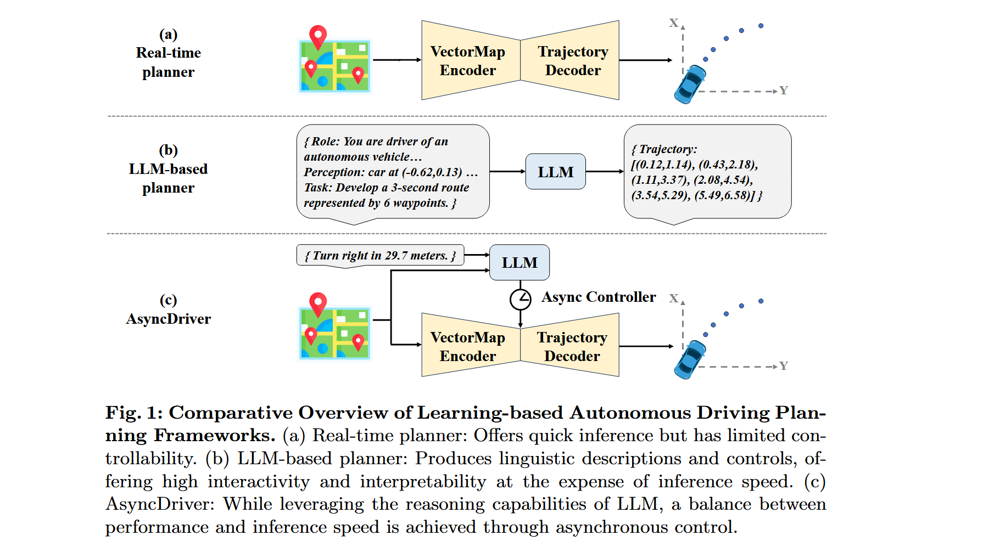

# Asynchronous Large Language Model Enhanced Planner for Autonomous Driving 

## Induction

currrent motion planning framework :

- learning-based real-time motion planning : 利用 vectorized map information 作为 input，employ a decoder 去预测轨迹

   - 易受长尾现象影响，在 rare or unseen scenarios 性能显著下降
 
   - 可控性低
     
- rule-based motion planning : 使用预先制定的规则去预测

  - 不足以捕捉整个潜在的复杂场景，易趋向于极端，要么过度谨慎，要么过度激进
 
  - 可控性低

- LLM-based motion planning : 使用 LLM 去预测，

  - 场景信息通过语言去描述，会受到 input token length 限制，使得捕捉精确且全面场景信息有挑战性
 
  - 语言输出预测轨迹不够精确 ：输出 high-level commands 容易引入误差，控制不够精确；直接用语言生成轨迹坐标，LLM 并不擅长精细的数值预测
 
  - prevalent framework 主要使用 LLMs 作为核心决策者，与 real-time planner 相比推理速度明显降低
    

> nuPlan ：由 Motional 发布的大规模自动驾驶规划数据集，主要用于研究路径规划 (planning) 任务，特别强调在闭环训练和评估环境 (closed-loop training / evaluation) 中测试学习驱动的规划模型 (learning-based planner)
>
> learning-based planner : 指用机器学习方法（特别是深度学习）来学习自动驾驶的规划模块
>
> real-time planner : 能够在极短时间内（毫秒级）做出路径或轨迹决策的模块或算法
> 
> vectorized map（向量化地图）: 用几何向量形式（点、线、面）表示地图中的关键元素，而不是像素点的图像（raseter map）来表示地图信息，更像是用 “坐标 + 属性 + 拓扑” 构成的可计算对象
>
> raseter map（栅格地图）: 把地图以像素网格（pixels）形式存储的数据结构，本质是一个二维数据/图像矩阵，每个 pixel 包括 RGB 值（纯图像）和类别标签（语义地图）
>
> asynchronous（异步）：在编程中，异步表示多个任务并发执行而不是一个个排队顺序执行
>
> inference frequency（推理频率）：指 LLM 被调用进行推理的次数或频率
>
> model predictive control（模型预测控制）：一种基于模型的最优控制方法，核心思想维：每一个控制时刻，利用系统动力学模型，在**未来一个时间窗口内预测系统行为**，通过**优化控制序列**使未来轨迹尽可能好（如偏离最小、控制能耗最小），只执行第一个控制动作，下一次再重新预测。
>   > intuition : MPC = 预测未来 + 求最优方案 + 实时滚动更新

## Data

## Methodology

## Experiment

