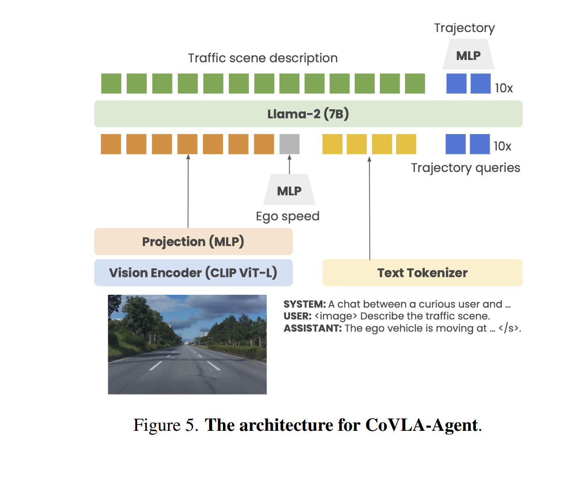
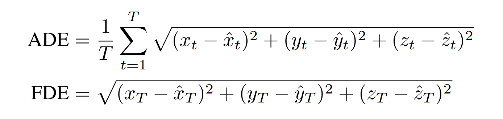
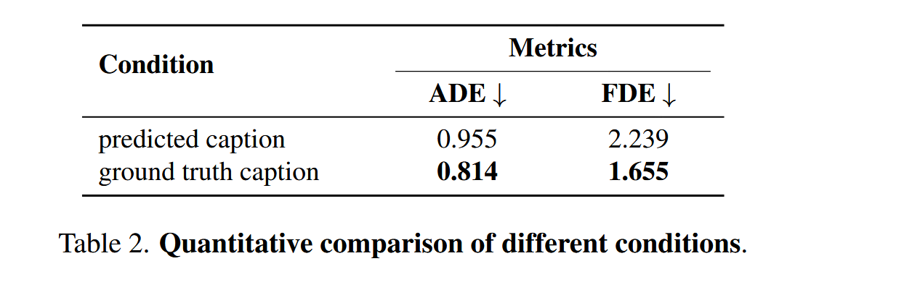
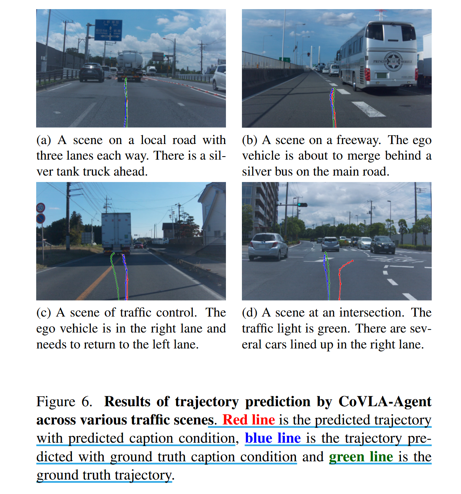
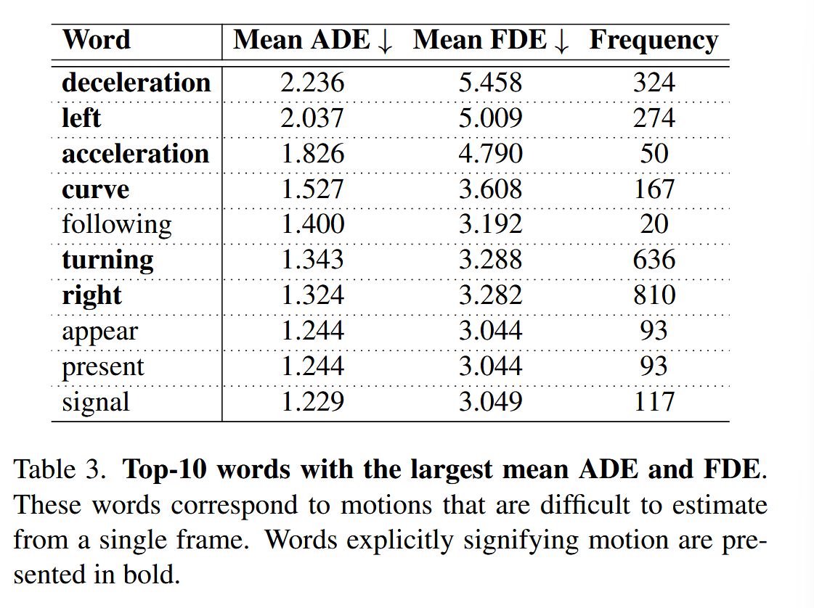

# CoVLA : Comprehensive Vision-Language-Action Dataset  for Autonomous Driving

> 由于本人较菜(qwq)以及刚接触 vla ,会记录更多的基础知识,以引用方式区分论文部分与基础知识

## Dataset Constrcution 

- [raw data][1]
- [data sampling][2]
- [auto labeling][3]
- [auto captioning][4]

[1]:
[2]:
[3]:
[4]:

### raw data

### data sampling 

sample criteria :

- 汽车处于驱动档时记录

- 最高速度不超过 100 km/h

-  GNSS 数据持续可用

> GNSS (Global Navigation Satellite System) : 全球卫星导航系统，如北斗、GPS等，GNSS 提供典型数据有：经纬度、速度、时间戳、航向等，在自动驾驶中主要用于定位和轨迹对齐。

sample process :

- 选择三个衡量驾驶行为的特征（最大转角、最大加速度、转向灯），前两个特征分箱处理
  
- 统计它们的联合经验分布（即现实中出现频率）

- 先采用加性平滑（平滑参数为 50），再使用分布值的倒数作为采样时的概率权重

> additive smoothing（加性平滑）: 又称 Laplace smoothing，一种用于解决概率估计中 “零概率” 问题的技术，核心思想为在每个概率估计中人为的加上一个常数 $\alpha$，从而避免概率为 0 的情况。

### auto labeling

- trajectory : 使用 GNSS 和 IMU传感器通过卡尔曼滤波器来估计车辆行驶路径

   -  对每一时间步，注释未来三秒的(60 frames)轨迹，轨迹数据使用以车辆为中心的全局坐标系

  -  有时 GNSS 数据的不稳定性会导致错误的轨迹，表现为显著的振动，使用一种[启发式][5]方法去识别并删除不准确的轨迹

[5]:

> Kalman Filter（卡尔曼滤波器）：一种递归算法，用于估计动态系统中的状态。核心思想是融合预测值和实际观测值，在不确定性中找到最优估计，通过 “预测 --> 更新” 来不断迭代。在此场景中，GNSS 更新频率慢但稳定，IMU 高频率但漂移，可通过卡尔曼滤波器有效融合起来。
>
> IMU（惯性测量单元） ：主要用来测量物体加速度和角速度的传感器，并通过这些信息推测物体的速度与位置变化，在短时间内较为精确，但存在漂移问题，即随时间推移，推算出的结果会逐渐偏离实际（由加速度计和陀螺仪测量时误差导致）。

- objects :

  - traffic lights : 采用 OpenLenda-s 模型去注释交通信号灯的颜色和箭头方向

  - leading vehicles : 结合雷达和前向摄像头的数据，记录 leading vehicle 的速度、加速度以及相对于自车的位置

### auto captioning 

- rule-based captioning : 考虑车辆运动和检测到的对象的各个方面，包括速度、加速度、轨迹曲率、前方车辆的存在和红绿灯状态，

- VLM-based captioning : 补充基于规则的字幕忽略的信息（如特定标志或不常见的对象），采用预训练 VideoLLaMA2-7B生成，

  - 在一个 60 帧（即 3 秒）的时间窗口内处理抽取的八张代表帧，包括该窗口的第一帧和最后一帧，每个 30 秒场景被划分为 10 个时间窗口

  - 共生成了 10 万条 captions，结合基于规则的 captions，共得到 600 万条 captions

- hallucination mitigation：用规则生成的 caption 来约束和补充 VLM 的生成输出，以提升准确性，缓解幻觉

  - 将 rule-based captions 作为上下文提供给 VLM，同时再加上一条提示语，要求它补充未涵盖的内容

  - 再查询模型并分析它内部的 token 概率分布选取概率最高词作为补充信息，内容包括：道路类型，天气情况、潜在风险等

  - 最后将 rule-based caption 和生成的补充信息当作事实锚点，引导 VLM 生成自由文本格式的描述

## Data Analysis 

- statistics : 覆盖更多复杂/边缘驾驶场景，不仅是大量无聊的 “正常行驶” 状态

  - 车辆速度和转向角的分布在采样后变得更加均匀，低速数据点明显增加，而转向角为 0 度附近的集中峰值减弱，从而实现在不同区间之间更均衡表示

  - 呈现出更多样化的驾驶动作，其中 16.11% 的帧包含转向灯，22.90% 的帧中出现交通信号灯

- comparision : 与其他数据集对比表现出来的优势

  - 自动化方法，得以构建出一个规模远大于依赖人工标注的数据集
 
  - 包含轨迹标注，即记录车辆运动路径的数据，通常包括每个时刻的位置、速度、加速度等 

  - 无缝集成了视觉、语言和动作模态

- limitation :

  - 生成的字幕中存在错误，如描述了不存在的物体，物体位置描述错误等
 
  - 对当地特殊地标的准确识别
  
## Experiment 

提出基线模型（base model），CoVLA-Agent

### model 

- architecture : 采用预训练 Llama-2(7B)作为语言模型，CLIP ViT-L(224 $\times$ 224 pixels)作为视觉编码器，此外将 ego vehicle's speed 用 MLP 投影嵌入。

  

- training ：在两个下游任务：traffic scene description generation 和 trajectory prediction ，前者采用 cross entropy loss，后者采用 MSE loss，并赋以相同的权重

### experimental setting

- data ：使用 CoVLA-Dataset，将 10000 个场景(scene)分为 70/15/15 for training/validation/testing。

  - 每个 scene 用 2HZ 采样，剔除不包含后续 3 秒所有轨迹点坐标的帧（共 60 帧）。再从这 60 个坐标点中采样 10 个点来表示未来的轨迹。得到一个包含 302,989/64,153/64,920 的数据子集。

  - 再将训练和验证数据集预处理成 LLaVA 指令微调格式（包括 system prompt, user instruction, assistant response）。

> LLaVA (Large Language and Vision Assistant) ：一种多模态模型，能输入图像 + 文本指令，并输出自然语言回答，基于大语言模型 + 图像编码器的架构。

- conditions : 为检查字幕对后续轨迹预测影响，准备两种条件 : predicted caption condition（采用 CoVLA-Agent 生成的字幕） 和 ground truth caption condition （采用真实的字幕）

- metrics : 采用 ADE(Average Displacement Error) 和 FDE (Final Displacement Error) 去评估轨迹预测准确率

### results

### discussion 

注意到图 d 中实际字幕包含 “moving straight”，预测字幕包含 “turn right”，在这两种不同字幕预测下，轨迹有明显的区别，这既说明了此类场景难以从单帧图像估计轨迹，又说明了 CoVLA-Agent 中语言动作的一致性。

为此，探讨当视觉语言模型生成的 caption 和真实 caption 不一致时，会如何影响轨迹预测的性能，如 ADE 和 FDE。

- 计算出现在 ground truth 但预测中没有或者出现在预测但 ground truth 中没有的词的平均 ADE 和 FDE

- 排除 stopwords，选取出现次数超过 10 次、且会导致最大 ADE 和 FDE 的前十高影响词汇

- 当预测与真实出现不一致时，尤其是与车辆方向或加速度相关的词语（如 “减速”、“左转”、“弯道”、“转弯”）出错，会造成较大的 ADE 和 FDE。

基于上述结果，认为由模型生成的 captions 导致预测轨迹表现差，主要是因为从单帧图像中推测驾驶意图是非常困难的。

> stopwords（停用词）: 像 "the", "is", "at", "in" 等这些对语义影响不大的词

## Supplementary Material

### heuristic trajectory filtering

- significant jumps（显著跳跃）:

  - 通过相邻点间距离过滤轨迹数据，给定 20 HZ 的记录频率和 100 km/h 的最大速度，则两点之间的距离最多应为 1.38 m，采用公差率为 1.15，阈值设为 1.59 m，超过此阈值轨迹将被过略。

- movement in the wrong direction（向错误的方向移动）：

  - 先手动检查了所有场景中的 400 个样本，确定了 43 个无效轨迹(10.75%)，观察显示，这些轨迹中振动频率为 10 HZ。

  - 先使用三点移动平均线对轨迹进行平滑处理，再计算平滑轨迹与原始轨迹线之间的差异，再分析这些差异的方差，如果方差超过某个阈值，则归类为无效。

  - 再测试数据集上验证，产生了 0.64 的精度(precision)和 0.75 的召回率(recall)，可将无效轨迹降至 2.6%，虽然假阳率较高（错误轨迹为阳），但对于数据集规模来讲是可接受的。
 

