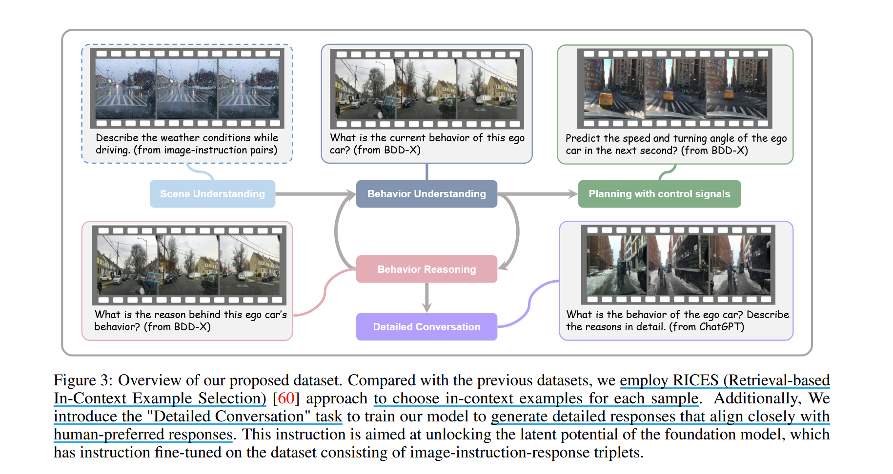
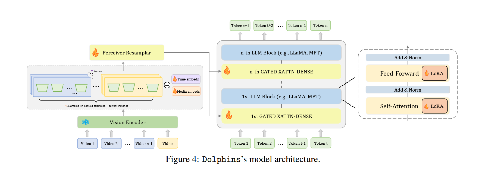
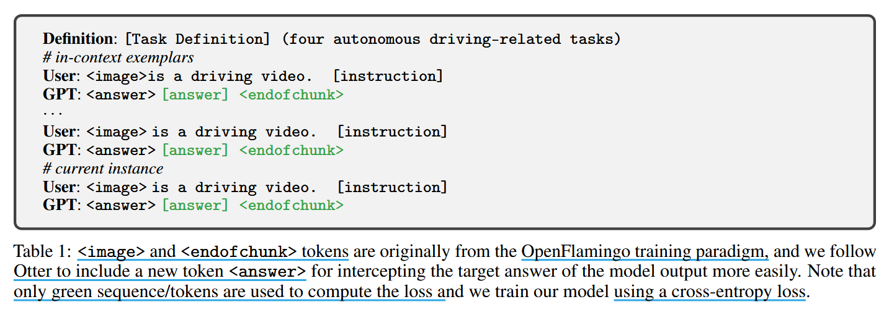

# Dolphins : MultiModal Language Model For Driving

## Induction

**What is the main problem addressed by this paper?**

- **Holistic Understanding and Interpretation** : 现有的数据驱动型自动驾驶系统无法全面理解和解释动态复杂场景，尤其是在开放世界驾驶环境的长尾分布中

- **Instant Learning and Adaptation** : 现有 ADS 需要大量数据的广泛训练来处理新情况

- **Reflection and Error Recovery** : 现有 ADS 在运行时一般采用前馈处理，缺乏基于反馈和制导的实时校正能力

**How does this paper address these problems?**

- 利用 VLM 的丰富知识库，并通过

- 

- 利用 vlm 强大的上下文学习能力来解决

## Method

为使 vlm 在 AD 中具备全面的理解能力和类似人类的能力，我们通过利用思维链（CoT）来培养 vlm 中的综合推理，并将其用于自定义 VQA 数据集。具体来讲设计一个视频文本交错数据集，在此数据集上对 vlm 进行微调。

GCoT 中描述 grounding method for CoT, 接着介绍自动驾驶中视频文本交错数据集的创建以及我们设计的任务，最后我们详细介绍 AD 的多模态上下文指令调优。

### GCoT Instruction tuning

推理能力基于细粒度的理解，而大部分 VLMs 由于在视觉-语言预训练中粗粒度对齐，使得其缺乏对视觉模态细粒度的多模态理解能力。

为此，我们设计了有实体锚定的推理链（GCoT）指令微调并且开发了一个基于这种能力的数据集，具体来讲：

1. 首先再通用数据集上创建 GCoT，以建立模型基本的推理技能。数据集具体创建流程如下：
  -  首先使用 ChatGPT 简要描述图像的内容
  -  其次让其识别问题中的物体并描述其空间为此
  -  然后问是否需要推理，要需要让其提供这一步的推理过程
  -  最后讲前三个步骤中 ChatGPT 生成的句子组合在一起，并在后面加上 "so the answer is {answer}"，形成一个完整的 GCoT 响应

2. 然后将这种基础能力转移到自动驾驶环境中，即在自动驾驶特定数据集上对模型进行微调。虽然数据集容量有限，但包含关键的驾驶场景、道路状况和相互作用。目的是使一般推理能力适应自动驾驶场景的特殊要求。

### Devised Instruction Tasks for Autonomous Driving

我们主要关注四个任务：

- **Behavior Understanding** : 使用来自 DriveGPT4 相同的描述指令来指导模型学习视频中的自我汽车行为

- **Behavior Reasoning** : 同样使用来自 DriveGPT4 的说明指令来使模型能够解释自我汽车的行为。

- **Prediction with Control Signals** : 根据历史的控制信号（如速度、加速度和转弯角度等）让模型预测下一秒的自我汽车的速度和转弯角度。由于 BDD-X 数据集中，不同视频片段持续时间不同，提供的历史控制信号数量取决于实际持续时间。

- **Detailed Conversation** : 前三个任务倾向于传统的视觉语言任务（短答案形式），依赖 ChatGPT 的上下文学习能力，对动作描述和推理标签进行丰富扩展，从而生成在人类偏好上更契合的长回答响应。

由于 DriveGPT4 数据集任务和指令多样性的限制，在该数据集上训练的 vlm 对未见任务的零概率泛化能力显著不足。所以我们利用多模态上下文指令微调来使模型仅用少量注释示例就能在 AD 相关任务中快速适应新指令。

> Multi-modal in-context instruction tuning ：在指令微调（instruction tuning）的基础上，把图像/视频等视觉证据与文本一起放入长上下文中，并在训练中显式加入少量示例（few-shot demonstrations）。让模型类比示例完成当前样本。
>
>   核心是：通过 “指令 + K 个多模态示例 + 新样本输入” 的串联序列进行因果语言建模（next-token prediction），仅对答案区域计损（loss mask）
>
 

我们提出的数据集包含 32k video-instruction-answer triplets，其中 11k 属于 ChatGPT 生成的详细对话内容。其余三个任务包含 21k 三元组。

### Multi-modal In-context Instruction Tuning in Autonomous Driving

在视觉指令微调方面，Otter 引入了上下文指令微调，以保持 vlm 的少样本和上下文学习能力。我们希望将上下文指令微调引入 AD 领域。

我们使用 OpenFlamingo 作为我们的基础 vlm，OpenFlamingo 是 Flamingo 的重新实现，它在图像-文本交错的 Lion-2B 和 MMC4 数据集上进行训练以增强其上下文学习能力。

我们使用自己构建的 AD 数据集，用检索方法为每个三元组选择上下文示例。即使用 VideoMAE 和 text-embedding-ada-002 作为图像编码器和文本编码器，将其分别映入潜在空间，然后根据每个样本的余弦相似度检索前 K 个上下文示例。

在我们之前的研究中发现，与使用图像特征相比，基于文本相似度的上下文示例检索在保持 vlm 的上下文学习能力方面更有效。因此我们只使用通过文本嵌入相似度检索的上下文，并在训练阶段讲上下文示例的提供限制为不超过 $k = 3$ 。

## Training

### Model Architecture

我们模型基于 OpenFlamingo 架构，命名为 Dolphins。该模型由视觉编码器 CLIP，从视觉编码特征进行重采样的 perceiver resampler，以及来自大语言模型的文本编码器，并且配备了用于图像-文本交互的门状交叉注意力层。

与 Flamingo 相比，OpenFlamingo 缺乏对 video input 的支持，因此我们引入了一组可学习的潜在向量作为时间位置嵌入，另一组可学习的潜在向量作为媒体位置嵌入以引入必要的顺序信息。这些嵌入的增加显著提高了模型的视频理解能力。

为减少计算消耗，我们冻结了编码器，只微调感知重采样模块、门控交叉注意力层和 LoRA 模块。

### Implementation Details

受 Otter 的启发，我们采用类似格式来准备指令微调数据集，此外还在每个任务开头引入一个特定的任务定义，作为任务级指令，有助于模型理解相同类型的自主驾驶相关视频-指令对的更广泛上下文。

相比于现有 vlm 的两阶段训练，第一阶段用于对齐视频文本特征，第二阶段用于视觉指令微调。我们第一阶段直接在配备 GCoT 的通用指令数据集微调，大二阶段在 AD 指令数据集进一步微调，以迁移细粒度理解和推理能力。

## Conclusion and Future Directions

