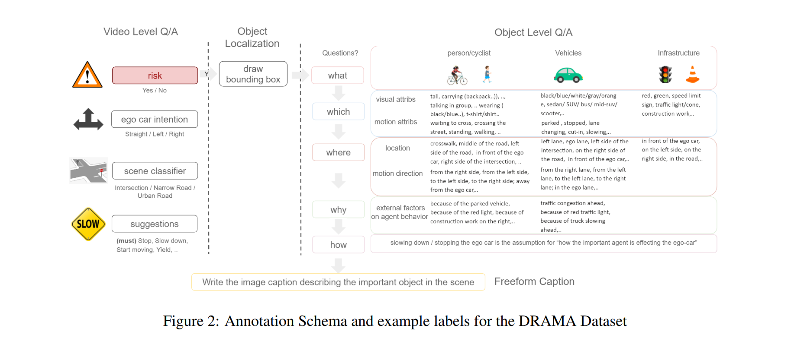
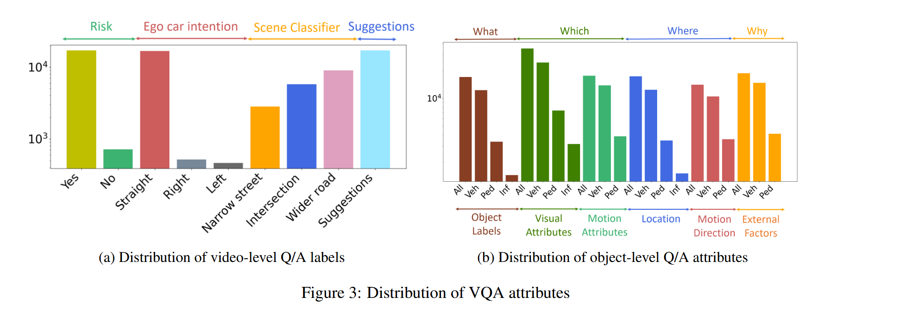
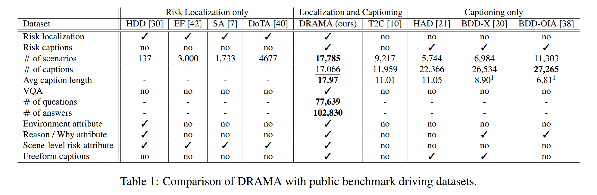
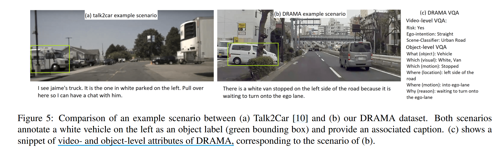
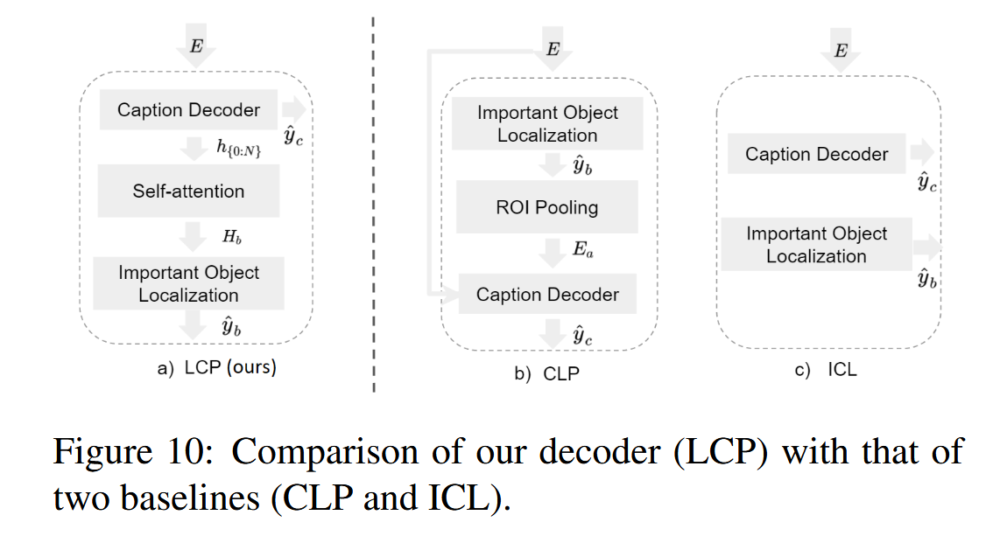

# DRAMA : Joint Risk Localization and Captioning in Driving

## Introduction

通过**字幕传达模型所理解的感知风险**作用：

- 一个可用于识别场景中风险因素的可解释模型

- 生成场景的语言描述以传达这些风险

**Existing important object identification approach in AD**:

- 在原始任务（如轨迹预测或转向控制）基础上，以自监督方式训练模型，

- 直接使用人工标注的对象级重要性去训练模型

**limitation in existing methods**：现有方法都没有以自然语言描述的形式来描述关于已识别的重要对象的描述

本文的主要贡献：

- 引入了一个新型数据集，该数据集提供**与重要物体相关的驾驶风险的语言描述**（重点关注原因），并可用于评估驾驶场景中的各种视觉描述能力。

- 呈现了一个数据标注策略，该策略适应了通过封闭式和开放式响应获得的视频级和物体级属性的独特特性。

- 提供了一个新的研究方向，即驾驶场景中的联合风险定位及其用自然语言去描述，并 DRAMA 数据集上基准测试了几个基线模型用于这些任务。

## Drama Dataset

### Dataset Creation

根据是否能激活车辆的制动来过滤视频，最终创建了 17,785 个交互式驾驶场景，每个场景持续时间为 2s。

Drama 注释旨在两方面：
  
  - 一是定位并识别重要物体
  
  - 二是依据这些物体对自车运动的直接/间接影响，生成相应的属性信息和自然语言描述（caption）。

具体来讲分为 Video-level Q/A 和 Object-level Q/A （可参考上图）

- video-level Q/A : 问题被设计为同时关注风险与场景属性，以及与自车行为相关的功能，例如自车意图和行为建议。
  - 有效的答案是封闭形式，如布尔格式（即是或否）或多个选项中的单个选项（如停下、减速、开始移动）

- object-level Q/A ：若场景被判断为危险，进行对象级注释，允许标注更复杂地推理

  - 如查询对象类型（what）、视觉和运动属性（which）、位置和运动方向（where）、关于风险和交互描述的推理（why）以及关系的影响（how）

### Dataset Statistics

Figure3a 显示了 video-level Q/A 的标签分布。每个场景先判断是否危险，在判断自我车辆此时状态（直行/左转/右转），然后再根据交互环境进行分类（较宽道路/十字路口/狭窄的街道）。

Figure3b 展示了 object-levle Q/A 的标签分布。识别出的重要对象包括车辆（vec）、行人或骑自行车的人（ped）、基础设施（inf）。对象级标注以更开放的形式进行。

### Dataset Analysis

Table1 展示了 DRAMA 与其他对风险定位或异常检测进行基准测试的对象定位数据集的比较。

- 与 HAD、BDD-X、BDD-OIA 这些驾驶领域的字幕数据集相比，虽然它们也以自然语言描述的方式解决自我车辆行为的建议和原因，但 DRAMA 额外包含了通过视觉推理来解决风险定位

- Talk2Car（T2C）是一个图像数据集，为每个边界框提供一个对应的文本描述，但标签不涉及驾驶风险，且描述是 “给车下达指令” ；而 DRAMA 则聚焦于标注重要物体及其风险描述，并结合视频的时空信息，从自车视角呈现场景

## Methodology

## Experiments

## Conclusion

