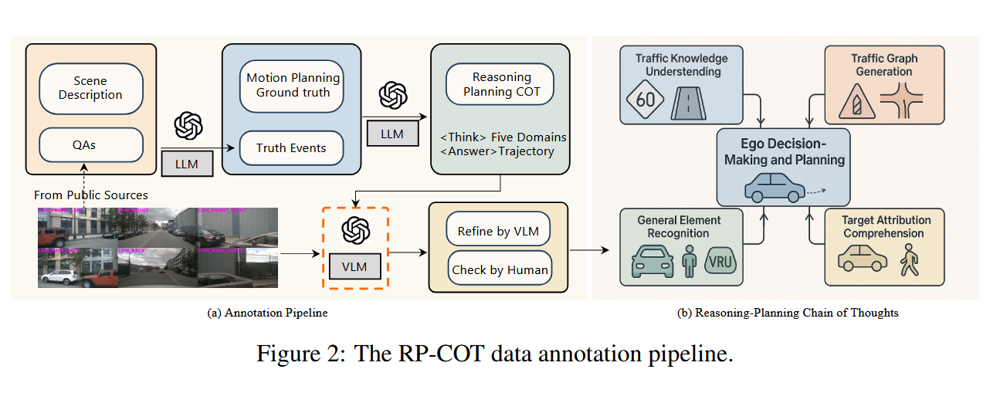
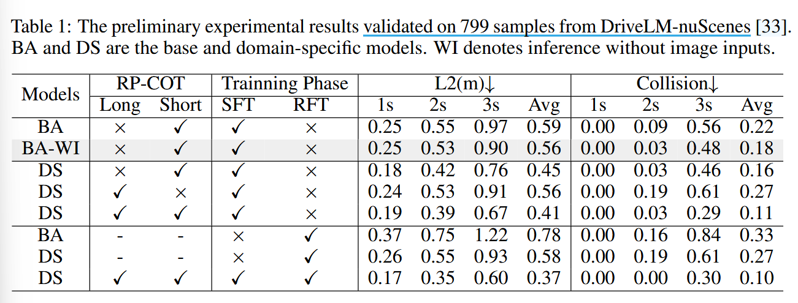

# Drive-R1: Bridging Reasoning and Planning in VLMs for Autonomous Driving with Reinforcement Learning

## What problem does this paper mainly address ?

- VLMs 过渡依赖历史文本输入信息，忽视视觉信息，

- CoT 训练时粗粒度的手工标注语言推理过程与细粒度的数值轨迹不对齐，以及简单情形的过度推理

## How does the paper address the above challenges?

- 使用 3 million AD QAs 全参数微调 Intern VL2-4B 缓解对历史信息的过度依赖，增强对 AD 场景的总体理解

- 使用构建的 RP-CoT 数据集进一步增强基于视觉信息的推理 

- 构建 fast-and-slow reasoning 数据集去缓解 CoT 监督阶段的不准确

- 使用 GRPO 提高效率与一致性，进一步协调推理和规划

## Methods

### RP-CoT Dataset Construction

根据[运动规划基础的五个关键领域][1]，即交通知识理解、通用要素识别、交通图生成、目标属性理解以及自车决策与规划，从 nuScenes 挑选场景，生成一步一步的文本推理，最终以轨迹决策为结束。

半自动构建流程：

- 挑选基于 nuScenes 的具有 QA pairs 的数据场景，由 ChatGPT 生成真实事实

- 基于真实事实生和运动规划信息成逐步推理过程，每个样本由 `<think> </think>` 包含推理步，和 `<trajectory> </trajectory>` 包含未来轨迹（6 points with 3 seconds）

- 使用 GPT-4o 对输出进行校正和优化，以保证与视觉场景相匹配

- 由人工注释员检查，保证一致性、正确性和规划有效性

### SFT Phase

观察到在无 CoT 监督情况下，直接训练 InternVL2-4B 输出轨迹可产生具有竞争性性能，且视觉输入被忽略时，模型表现更好，归因于：

- 模型对 AD 中 DS 任务缺乏足够的熟悉度

- 模型对历史运动线索比对场景级别视觉信息更敏感

因此，在 SFT 第一阶段，使用 3 million AD QAs 全参数微调 Intern VL2-4B 缓解对历史信息的过度依赖。但视觉信息推理仍不够充分，使用 RP-CoT 数据集进行 SFT 第二阶段训练。

然而，直接应用长 CoT 会降低模型输出轨迹准确率，最近研究也发现了类似现象，对于涉及空间推理或数值敏感性任务，与直接答案监督训练的模型相比，使用 CoT 监督训练的模型往往表现不加。归因于：

- 小规模模型的表征能力有限，这限制了它们对复杂推理路径的准确编码和利用能力

- 模型在处理文本输出和数值输出时对错误的容忍度不同。具体来讲，由于注释不完善以及模型内在限制导致的语义不一致与幻觉，在文本推理阶段可以忽略，但传播到数值预测阶段会被放大为严重的错误。

在 SFT 第二阶段，采用 fast-and-slow thinking 策略，使用未经 CoT 监督训练的模型去生成轨迹输出，以此为依据衡量场景的复杂度，复杂度高的用长 CoT 注释，反之用短 CoT 注释进。

### RL Phase

研究表明，[rl 微调模型后产生的推理路径已经高概率地存在于基本模型地输出][3]，[RL model 可以解决的问题，可以通过充分的采样由基本模型解决][4]。因此采用 GRPO 不是为了从根本上释放新的能力，而是作为一种协调机制以提高效率与一致性。

[1]:https://arxiv.org/abs/2503.21505 
[2]:
[3]:https://arxiv.org/abs/2501.17161
[4]:https://arxiv.org/abs/2504.13837

