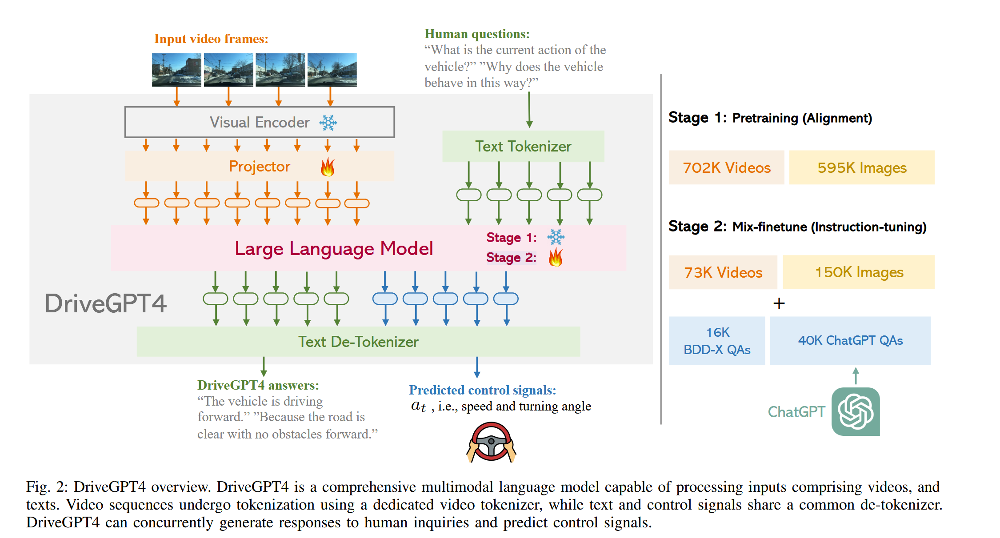

# DriveGPT4: Interpretable End-to-end  Autonomous Driving via Large Language Model

## What are the main contributions of this paper ?

- 首次利用 LLMs 实现 end-to-end interpretable autonomous driving system，DirveGPT4，4代表多模态（multimodality），与 MiniGPt4 相似

> DriveGPT4 接收前置单目 RGB 摄像头捕获的视频序列作为输入，然后预测下一步控制信号（如车辆速度和转向角）

- 开发了一个定制与可解释自动驾驶的 visual-instruction tuning dataset

- 在 BDD-X 数据集上进行了评估

> Blip 利用 Q-formers 将 multimodal input 投影到 text space，Llava-med 等简单训练一个 fully-connected layer 作为 projector 。
>
> 挖坑，读下 Blip 和 Llava-med
> 

## Data Generation

从 BDD-X 采样视频序列和标签，由 16,803 clips 用于训练，2,123 clips 用于测试。每个 clip 被分为 8 images，BDD-X 数据集为每帧提供控制信号数据（如车速和转向角），还包含对每个视频片段的车辆动作描述和动作理由的注释。

最终训练时收集 56k video-text instruction-folloeing samples，包括 16K BDD-X QAs 和由 ChatGPT 产生的 40K QAs 。

### BDD-X question-answerings

BDD-X 提供三种类型标签：vehicle action descriptions、action justifications、control signals for each video clip

为防止 LLM 过拟合于固定的问题模式，创建三个同义但不同表述的问题集 $Q_a , Q_j , Q_c$，每次训练时随机采样，采用 BDD-X 类型标注作为真实标签。

- $Q_a$ 包含相当于 "What is the current action of this vehicle" 的问题，对应 vehicle action description 标签 

- $Q_j$ 包含相当于 "Why does this vehicle behave in this way" 的问题，对应 action justification 标签

- $Q_c$ 包含相当于 "Predict the speed and tuning angle of the vehicle in the next frame" 的问题，对应 control signals 标签

### Additional QAs generated by ChatGPT

尽管按上述方法，这些 QA pairs 有固定刚性的内容，缺乏多样性，仅在 QAs pairs 上及逆行训练会降低 LLMs 的性能并使其无法回复其他格式的问题。

先用 YOLOv8 生成每帧目标框，再将其与视频片段和真实控制序列以及字幕输入 ChatGPT，遵循 LLaVA 格式，提示生成多个回合和类型的对象。

## DriveGPT4

### Model Architecture  

DriveGPT4 is mLLM：

- video tokenizer based on Valley，视频呗均匀采样成固定的数量的图像

- LLM use LLaMA2

- 类似 RT-2，文本和控制信号使用相同的 text de-tokenizer

#### Video tokenizer

对每帧图像，使用预训练 CLIP visual encoder 去提取特征 $F_i \in R^{257 \times d}$，第一个通道 $F_i$ 代表 global feature，其余通道代表 path features。为方便表示分别记为： $F_i^G$ , $F_i^P$

Temporal visual feature of the entire video ( $\oplus$ 代表拼接) :

$$
T = F_0^G \oplus F_1^G \oplus \ldots \oplus F_N^G
$$

spatial visual feature of the whole video:

$$
S = Pooling( F_0^P , F_1^P , \ldots, F_N^P)
$$

最后使用 projector(?) 将时间特征 T 和空间特征 S 投影到文本域。

#### Text and control signals 

Control signals 与 text 使用相同的分词器，采用 default LLaMA tokeizer。text input 中包含自车速度和输入视频长度。

预测出的控制信号使用固定格式嵌入到输出文本中，便于提取。

### Training 
 
**Pretraining**  冻结 CLIP encoder and LLM weights，仅训练 projector。使用 593K image-text pairs from CC3M 和 703K video-text pairs from WebVid-2M

**Mix-finetune** 冻结 CLIP encoder，仅训练 LLM and projector。使用 56K video-text 指令跟随数据微调，但 56K AD domain data 对于 LLM 微调不充分，使其有严重的幻觉问题。再利用 LLaVA 和 Valley 生成的 223K 通用指令跟随数据进行混合微调。"Mix" 代表将通用指令数据和任务特定的指令调优数据一起用于训练。先使用 223K 进行微调再使用 56K 进行微调。

## Experiment

## 扩展阅读

Visual instruction tuning :

- 阻止 LLM 过拟合于固定问题模式，每个问题集应包含一个问题的多个同义表达

Valley: Video assistant with large language model enhanced ability：

- 怎么做对齐

Learning transferable visual models from natural language supervision,
