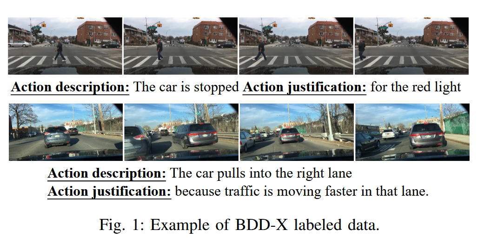

# DriveGPT4: Interpretable End-to-end  Autonomous Driving via Large Language Model

## What are the main contributions of this paper ?

- 首次利用 LLMs 实现 end-to-end interpretable autonomous driving system，DirveGPT4，4代表多模态（multimodality），与 MiniGPt4 相似

> DriveGPT4 接收前置单目 RGB 摄像头捕获的视频序列作为输入，然后预测下一步控制信号（如车辆速度和转向角）

- 开发了一个定制与可解释自动驾驶的 visual-instruction tuning dataset

- 在 BDD-X 数据集上进行了评估

> Blip 利用 Q-formers 将 multimodal input 投影到 text space，Llava-med 等简单训练一个 fully-connected layer 作为 projector 。
>
> 挖坑，读下 Blip 和 Llava-med
> 

## Data Generation

从 BDD-X 采样视频序列和标签，由 16,803 clips 用于训练，2,123 clips 用于测试。每个 clip 被分为 8 images，BDD-X 数据集为每帧提供控制信号数据（如车速和转向角），还包含对每个视频片段的车辆动作描述和动作理由的注释。

### BDD-X question-answerings

BDD-X 提供三种类型标签：vehicle action descriptions、action justifications、control signals for each video clip

为防止 LLM 过拟合于固定的问题模式，创建三个同义但不同表述的问题集 $Q_a , Q_j , Q_c$，每次训练时随机采样，采用 BDD-X 类型标注作为真实标签。

- $Q_a$ 包含相当于 "What is the current action of this vehicle" 的问题，对应 vehicle action description 标签 

- $Q_j$ 包含相当于 "Why does this vehicle behave in this way" 的问题，对应 action justification 标签

- $Q_c$ 包含相当于 "Predict the speed and tuning angle of the vehicle in the next frame" 的问题，对应 control signals 标签

### Additional QAs generated by ChatGPT

尽管按上述方法，这些 QA pairs 有固定刚性的内容，缺乏多样性，仅在 QAs pairs 上及逆行训练会降低 LLMs 的性能并使其无法回复其他格式的问题。

## DriveGPT4

### Model Architecture  

### Training 

## 扩展阅读

Visual instruction tuning :

- 阻止 LLM 过拟合于固定问题模式，每个问题集应包含一个问题的多个同义表达

