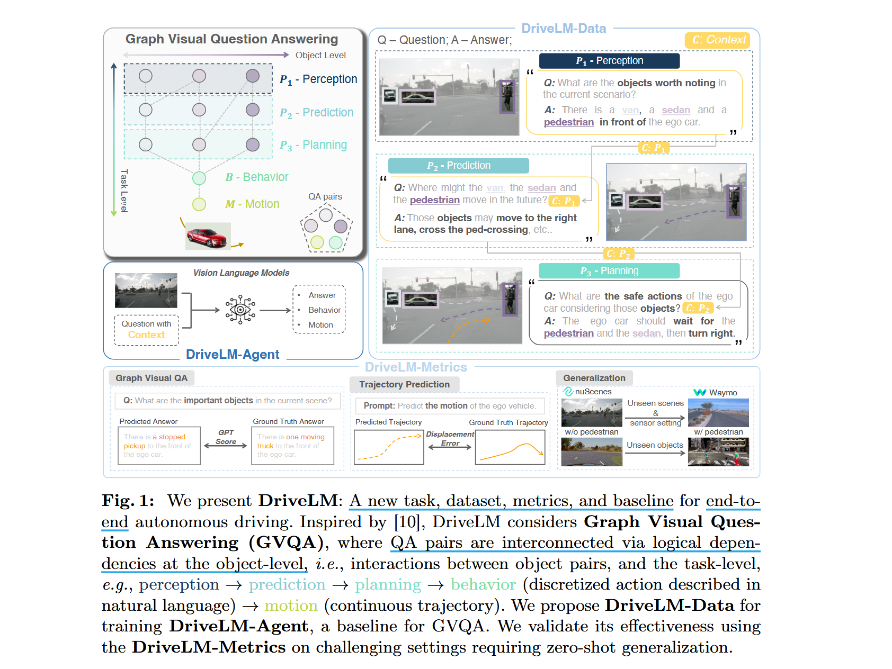
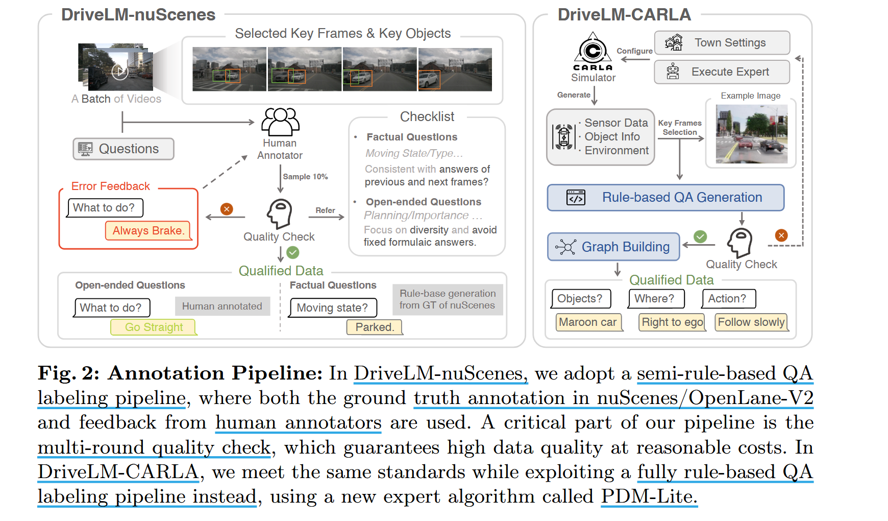

# DriveLM:  Driving with Graph Visual Question Answering

## Introduction

**Apply VLMs to AD in recent work**:
  
  - **scene-level** visual question answering：指通过一个或两个支持理由来描述驾驶行为的任务，如 “汽车正驶入右车道，因为这样做是安全的”

  - **single object-level** visual question answering：指以 "what-which-where-how-why" 形式，通过一系列 QAs 来理解 ego vehicle 对单个对象的反应，如 “本车停下来是因为有一个穿白衬衫的性人在本车前面穿过十字路口，本车不想撞到行人”、

**current method's limitation**：这两种范式都没有提供合适的代理任务去模拟人类的 $P_{1-3}$ 推理过程，人类考虑多个对象并分多个步骤对每个对象进行推理

**Our contribution**: 

- **Task. Graph Visual Question Answering (GVQA)**: 图形视觉问答（GVQA）任务将P1−3推理过程表示为**一组有向图中的问答对（QAs）**。与 VQA 任务的关键区别在于，GVQA 具有问答之间的逻辑依赖关系，这些依赖关系可用于指导回答过程。GVQA 还包括关于行为和运动规划的问题，并有专门的评估指标

- **Datsets. DriveLM-nuScenes** and **DriveLM-CARLA**: 由带注释的 QAs 排列成图表的形式组成，通过逻辑推理将图像与驾驶行为联系起来。与现有基准相比，每帧提供了更多的文本注释。

- **Baseline. DriveLM-Agent**: 采用了一种通用的轨迹分词器（trajectory tokenizer），可以简单有效地将 VLM 应用与 end-to-end AD

## 2 DriveLM : Task, Data, Metrics

- section 2.1 阐述 GVQA 任务的构建
- section 2.2 介绍 DriveLM-Data
- section 2.3 概述用于评估的 DriveLM-Metrics

### 2.1 DriveLM-Task: GVQA

## DriveLM-Agent: A GVQA Baseline

### Prompting with Context

### Trajectory Tokenization for Motion

## Experiments

## Related Work

## Discussion

