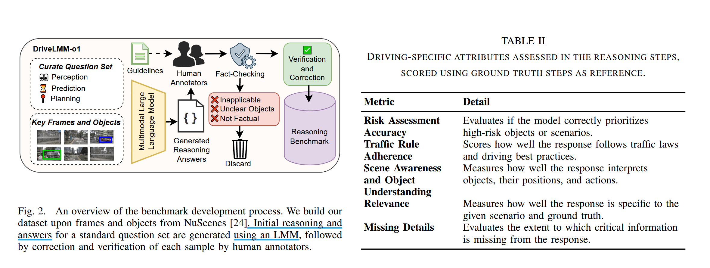
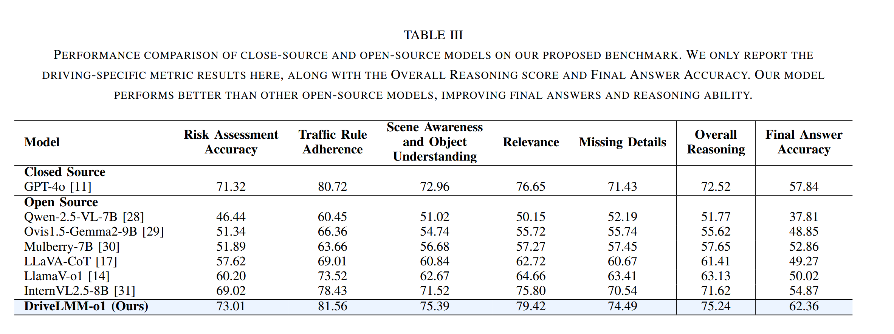

# DriveLMM-o1: A Step-by-Step Reasoning Dataset and Large  Multimodal Model for Driving Scenario Understanding

## Introduction

### What are dificiencies of existing datasets and benchmarks ?  

> 这里 dataset、benchmark 特指自动驾驶中 VQA 数据集和基准

- 只集中于 end-task performance，忽视了中间推理步骤的质量和透明度

- 缺乏多模态多样性，许多基准主要依赖单视图和有限注释，不足以评估复杂的空间关系和顺序决策

> 数据集是任务的数据资源，基准是评估方法体系，包含数据、评价指标、基线模型等

### What are advantages of DriveLMM-o1 benchmark and dataset ?

- 整合了多模态输入，包括多视角图像、LiDAR 点云、清晰的推理步骤

- 提出一个评估框架，用于评估中间推理的逻辑连贯性和最终答案的准确性

> LiDAR ：全称 Light Detection And Ranging（光探测与测距）
>
> 点云 ：由很多个激光扫描点组成的集合，表示三维空间中物体的表面形状。每个通常包含：位置、、强度值/反射率、事件戳、标签信息等。一个完整的扫描帧就是一幅稠密活稀疏的 3D 点的集合。
> 
> curriculum learning （课程学习）：一种模仿人类学习过程（先学简单的，再学难的）的机器学习策略，在训练模型时，不是把所有训练样本随机打乱训练，而是设计一个 “由易到难” 的学习顺序，让模型先掌握基础能力，再逐渐面对更复杂任务。
>
> beam search （束搜索）：一种常用于序列生成任务的搜索算法，与其值保留 “最优一条路径”，不如保留 “可能性前 k 高的路径”，以提升生成质量。

## Benchmark 

### benchmark development

- question set curation :

  - 设计了一套包含 10 类问题的标准化问题模板

  - 涵盖自动驾驶中感知、预测和规划三个核心任务

  - 这些问题都需要逐步的逻辑推理才能得到正确答案，从而模拟自动驾驶系统实际需要做的决策步骤

- automated generation :

  - 使用 GPT-4o 自动生成初始推理步骤和答案
 
  - 提供了一个设计好的提示，带有明确的指示和定义明确的输出格式以指导生成结构化推理链
 
  - 生成的答案遵循逻辑上的渐进式推理过程，须依次描述观察结果、关键实体之间关系以及最终结论

- manual correction and verfication ：人工筛选掉不合适的样本，对保留的样本进行进一步的优化推理步骤

### evaluation methodology 

- 使用 GPT-4o 参考真实答案对推理过程打分

- 使用结构化的评估提示词，包含详细的评分标准、预设的评分等级、标准化的 JSON 输出格式

- 最终推理得分为所有指标评分的平均分

- 此外，对于所有选择题 (multiple choice question, MCQ)，也统计最终答案的准确率

## base model

- input : 处理拼接后的 multiview images，使得模型既能同时处理不同视角图像，又避免了跨视图独立特征提取，提高计算效率
  
- fine-tune InternVL-8B (ViT + LLaMA-2，支持动态分辨率输入) ：冻结数据编码器和语言模型的大部分层，在 LLaMA 主干的注意力层中使用 LoRA(low-rank adaptation) 进行微调，具体来说，将可训练的低秩矩阵注入到自注意力机制中的 query、key、value 的投影中

## Experiments

### training dataset

- 与 benchmark 构建方式一样，除了未经严格验证

- 包含 1962 个驾驶场景，18507 个基于推理的 Q&A pairs

- Q&A pairs 伴随超过 55,000 个推理步骤

### experiment setup

- 使用 LoRA 适配器(rank=16)进行一次 epoch 的有监督微调，冻结了视觉编码器和所有大语言模型层，使得仅 0.49% 的总参数可训练

- 采用动态图像切片技术，将大图划分成小块输入 InternVL 

### results  

