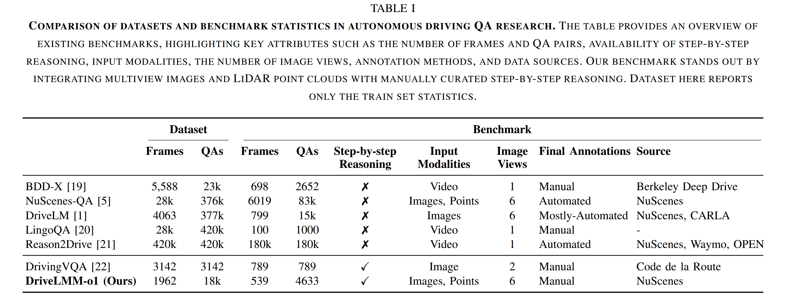

# DriveLMM-o1: A Step-by-Step Reasoning Dataset and Large  Multimodal Model for Driving Scenario Understanding

## Introduction

### What are dificiencies of existing datasets and benchmarks ?  

> 这里 dataset、benchmark 特指自动驾驶中 VQA 数据集和基准

- 只集中于 end-task performance，忽视了中间推理步骤的质量和透明度

- 缺乏多模态多样性，许多基准主要依赖单视图和有限注释，不足以评估复杂的空间关系和顺序决策

> 数据集是任务的数据资源，基准是评估方法体系，包含数据、评价指标、基线模型等

### What are advantages of DriveLMM-o1 benchmark and dataset ?

- 整合了多模态输入，包括多视角图像、LiDAR 点云、清晰的推理步骤

- 提出一个评估框架，用于评估中间推理的逻辑连贯性和最终答案的准确性

## benchmark 

