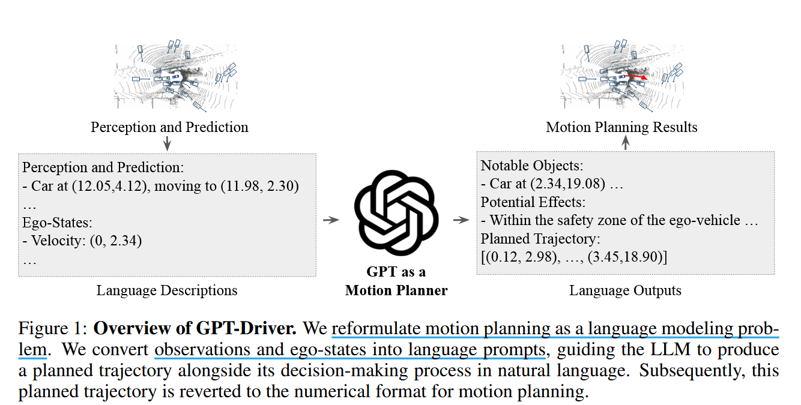
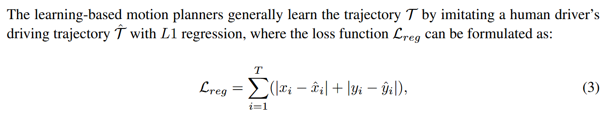
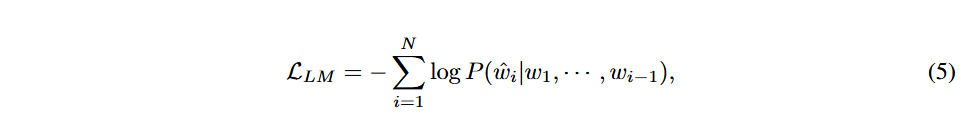
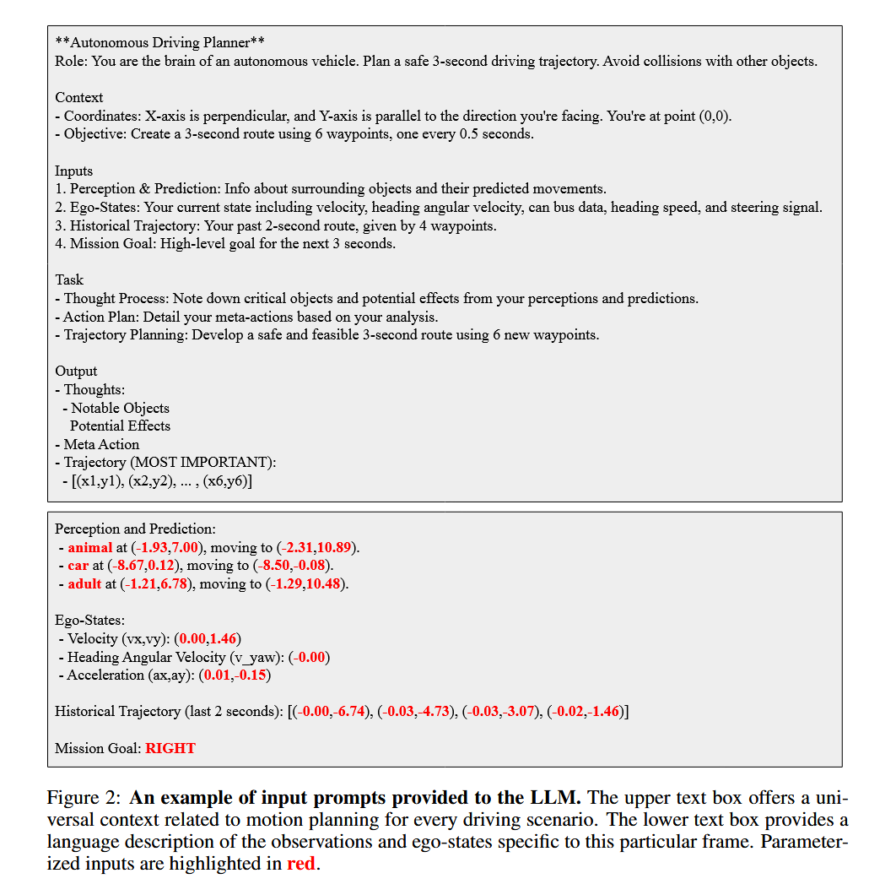
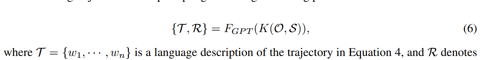
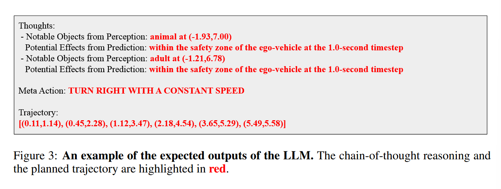
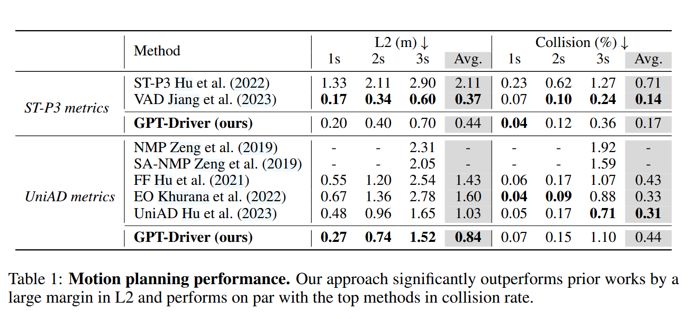
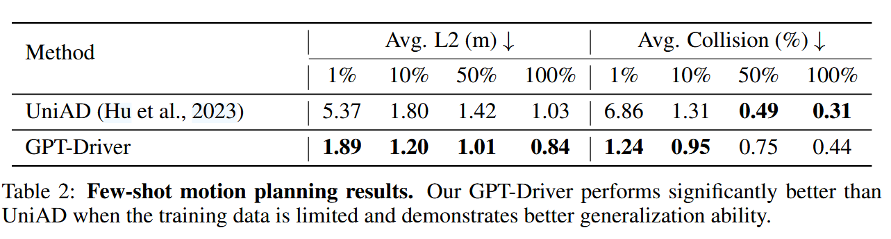
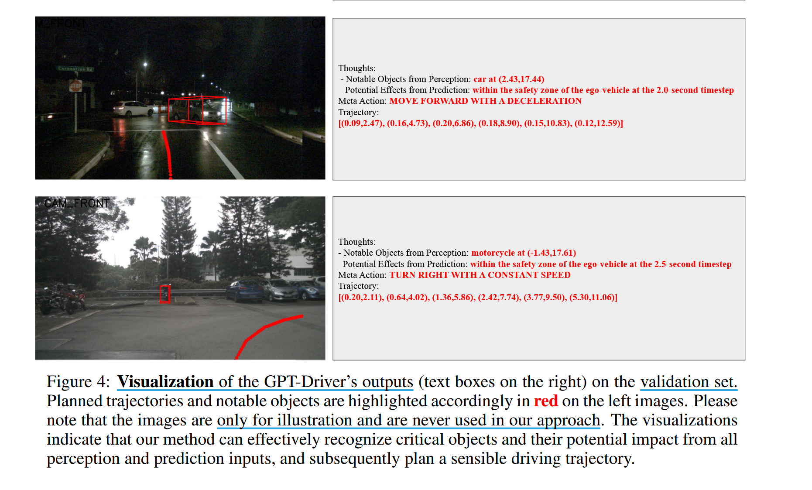
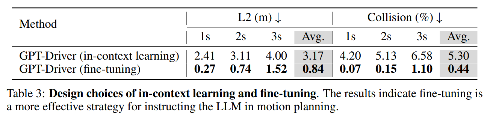

# GPT-Driver: Learning To Drive With GPT

## Induction

### What are major challenge that planner face ?

- process heterogeneous inputs, e.g. ego-vehicle information, maps, and perception results

- need to predict high-precision waypoint coordinates that represent a future driving

### How does this paper tackle these challenges ?

- 将 motion planning 看作 language modeling problem，将 heterogeneous planner inputs 对齐到 unified language tokens

- 提出 **prompting-reasoning-finetuning strategy**，让 GPT-3.5 先在自动驾驶场景中提示，然后进行思维链以产生合理输出，最后根据人类的驾驶轨迹对模型进行微调。能把误差控制在厘米级 

## GPT-Driver

### Problem Definition

虽然简单，但该方法试图同时回归不同尺度的航路点，例如，坐标值范围从 0 到 50 以上，通常回导致较远航路点的坐标估计不精确。

### Motion Planning As Language Modeling

展示如何重新制定运动规划作为一个语言建模问题，并缓解航路点坐标估计精度问题。

从 tokenizer 角度可解释语言建模为何在运动规划中误差更小。以坐标 23.17 为例，通过 tokenizer，被分解为 "23", ".", "17"。因此预测这个航点坐标本质上是首先估计一个米级别的粗略位置（这里为 23），然后估计一个厘米级的细粒度位置（这里为 17）.此外这是通过对词汇表中正确的符号进行分类来建立估计，不是对它们的绝对值进行回归。

作者关键的观察是，一个常用的 language tokenizer，如 GPT tokenizer 已经有足够的能力去估计非常精确的数值运动规划，使得该方法更通用，也与自然语言兼容。

### Prompting-Reasoning-Finetuning

介绍如何使用一种新的提示推理策略来解决语言建模问题，简单的使用 GPT3.5 效果并不好

即使用 GPT tokenizer K 将观察 O 和自车状态 S 转化为语言提示，再将这些提示输入到 GPT-3.5 模型 $F_{GPT}$ 中，接下来详细介绍 prompting, reasoning, fine-tuning 过程

**prompting** ：使用 LLM 进行运动规划的一个关键障碍在于数据类型的差异，即运动规划器处理的观察和自车状态等异构输入，而 LLM 主要时为处理语言输入而设计的。将观测和自车状态的参数化表示，并转换为语言描述。

  - 对每个物体，构建一句话来描述这些属性，这些句子共同组成了感知提示

  - 将检测物体的未来轨迹参数化并转化为自然语言描述，来生成预测提示

  - 通过描述自车的当前状态（如速度和转向）来生成自车状态提示

  - 此外还会提供有关运动规划的一般上下文信息，如坐标系，目标等。最后使用 ChatGPT-4将这些提示重新表述得更简明，并将其作为输入提供给 GPT-3.5 模型

**reasoning** : 当前运动规划器一个常见弱点在于可解释性有限，为此提出一种全新思维链策略：

  - 首先，根据感知结果，运动规划器需要识别那些可能影响行驶动态的关键物体

  - 其次，通过分析这些关键物体未来的运动轨迹（由预测结果给出），规划器应推断出这些关键物体在何时、何地以及如何影响自车（ego vehicle）

  - 最后，在上述分析基础上，规划器需要做出高层次的驾驶决策，并将其转化为一条具体的规划轨迹。

**fine-tuning**：利用 OpenAI 的微调 API，具体来说：

- 从实际驾驶日志中收集每个场景下的人类驾驶轨迹

- 不手动写推理过程，而是采用自动生成方法。

  - 假设轨迹生成：根据自车当前速度和加速度，假设没有外部干扰，生成一条理想的自车轨迹。
  - 关键物体识别：判断场景中其他物体的当前位置和预测路径是否与假想轨迹有重叠。如果有，则这些物体被视为关键影响因素，并记录其潜在影响，从而自动生成推理链

- 利用 OpenAI fine-tuning API，对模型进行微调，模型输出为自然语言格式的计划轨迹。在评估时，将输出的轨迹文本还原为数值化轨迹，用于实际效果对比和评估

## Experiments

先介绍**实验设置和评估指标**，再在 **nuScenes** dataset 上与 SOTA 模型进行比较，最后评估我们方法的**泛化**和**可解释性**。

### Experiments Setup

**nuScenes dataset** 包含 1000 个驾驶场景，大约 40000 个关键帧，包括各种位置和天气条件。遵循 ST-P3 和 UniAD 将数据集划分维训练、验证、测试集。

采用 UniAD 评估指标去评估生成的轨迹。包含 L2 error(in meters) 和 collision rate(in percentage)。碰撞率是通过检查自车的三维边界框是否和其他物体的真实边界框发生碰撞来计算得到。

### Comparison Against the State-Of-The-Art Methods

Een-to-end 像 UniAD 执行运动规划依赖于内部的感知和预测输出，为公平比较，我们也使用它们模型的感知和预测输出来比较。

值得注意的是，其他基线方法严重依赖于诸如后优化之类的技巧来降低碰撞率，相比之下我们的方法并不依赖于这些技巧。此外，UniAD 除检测和预测外，还严重依赖密集的占用网格和地图，使得他们的系统复杂且耗时。

### Few-Shot Motion Planning

为保证公平，UniAD 和我们方法利用相同的预训练检测和预测模块作为输入，所有其他参数保持不变。 

### Interpretability

### Fine-Tuning vs. In-Context Learning

微调和上下文学习是指导 LLM 完成特定领域任务的两种常见策略。我们实验表明微调效果要好于上下文学习，主要是因为模型上下文窗口在上下文学习中是非常有限的。例如在次情景中，GPT-3.5 每次最多只能容纳 5 个范例输入。因此，微调策略策略必不可少。

### Limitations

由于 OpenAI api 的限制，我们无法获得模型的推理时间，而通常于基于 MLP 规划器相比基于 gpt 的规划器的推理时间较长
 
由于开环运动规划不能完全模拟驾驶过程中的误差累积，近年来闭环运动规划也越来越多得用于运动规划器的性能评价。将 GPT-Driver 的闭环运动规划留给以后的工作。 

