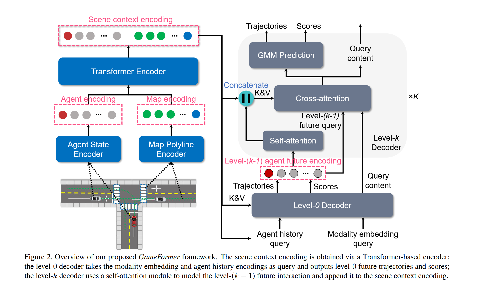

# GameFormer: Game-theoretic Modeling and Learning of Transformer-based  Interactive Prediction and Planning for Autonomous Driving

## Induction

## Model

### Game-theoretic Formulation

### Scene Encoding

### Feature Decoding with Level-k Reasoning

### Learning Process

## Experiments

