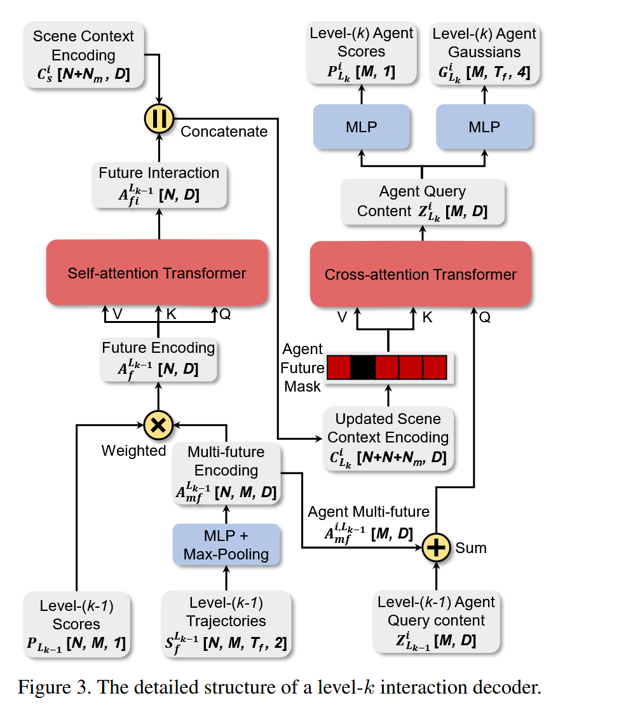
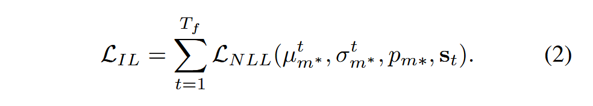
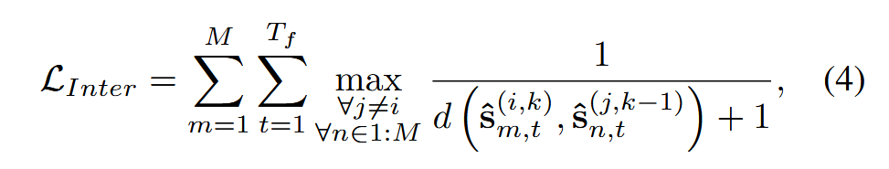
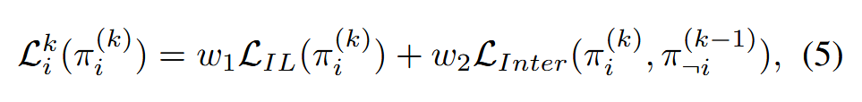

# GameFormer: Game-theoretic Modeling and Learning of Transformer-based  Interactive Prediction and Planning for Autonomous Driving

## Induction

## Model

**GameFormer** : 交互预测和规划框架，采用 Transformer encoder-decoder architecture  

### Game-theoretic Formulation

定义问题并讨论指导模型设计和学习过程的 level-k game theory 

### Scene Encoding

介绍编码上下文信息的编码器

- **input representation** : 输入数据由 agent 的历史状态信息 $S_{p} \in R^{N \times T_{h} \times d_{s}}$ 和局部 vectorized map polylines $M \in R^{N \times N_{M} \times N_{p} \times d_{p}}$ 组成

  - $d_{s}$ 代表 state 属性的数量；$N_{m}$ 代表临近地图元素（如路线或人行横道）数量，其中每个都包含具有 $d_{p}$ 个属性的 $N_{p}$ 个 waypoints  

  - 所有输入都以当前 ego agent 位置为远点，方向为正方向进行坐标系变换，缺失值用 0 填补

- **agent history encoding** : 用 LSTM 编码每个 agent 的历史状态信息 $S_{p}$，得到 $A_{p} \in R^{N \times D}$，D代表隐藏层维度

- **vectorized map encoding** : 使用 MLP 生成地图特征张量 $M_{p} \in R^{N \times N}$ 以对齐特征维度 D，再将属于同一地图元素的 waypoints 分组，对同一组内的点使用 max-pooling 聚合特征以减少 token 数量，最终得到维度为 $M_{r} \in R^{N \times N_{mr} \times D}$ 的地图特征张量，其中 $N_{mr}$ 代表聚合地图元素数量 

- **relation encoding** : 将每个 agent feature 和对应 local map feature 拼接在一起得到 agent-wise 场景上下文张量 $C^{i} = [A_{p} , M_{p}] \in R^{(N + N_{mr}) \times D}$ ,再用 E 层 Transformer 编码器去建模每个 agent 上下文张量 $C_{i}$ 中所有场景元素间关系，最后输出一个场景上下文编码张量 $C_{s} \in R^{N \times (N + N_{mr}) \times D}$，作为后续解码器网络的通用环境背景输入。

### Feature Decoding with Level-k Reasoning

介绍整合了交互建模的解码器

- **modality embedding** : 为了应对未来的不确定性，为每一种可能的未来初始化一个模态嵌入向量，这些模态嵌入将作为 level-0 解码器的查询向量，可通过 heuristics-based method、learnable initial queries、data-driven method 方式生成，具体来讲，生成一个 learnable 的模态嵌入张量 $I \in R^{N \times M \times D}$，M 代表未来模态数量

- **level-0 decoding** : 

  - utilize a multi-head cross-attention Transformer, 输入由 initial modality embedding I 和 agent's historical encoding $C_{a,A_{p}}$ （通过模态维度扩展，将历史轨迹编码沿模态维度复制 M 份）相加得到即 $(C_{s,A_{p}} + I) \in R^{N \times M \times D}$ 作为 query，key 和 value 是整个场景上下文 C_{s}
 
  - 将注意力机制用在每个 agent 的模态维度，输出 $Z \in R^{N \times M \times D}$ 表示每个模态下的上下文表示，接着在 $Z_{}$ 上连接两个多层感知机，分别预测 GMM 分布参数 $G_{L_{0}} \in R^{N \times M \times T_{f} \times 4}$ （对应每个时间步的 $(\mu_{x}, \mu_{y}, log\sigma_{x}, log\sigma_{y})$） 和输出该模态的得分（置信度） $P_{L_{0}} \in R^{N \times M \times 1}$  

- **interaction decoding**

  - 交互解码阶段包含 K 层，每层代表一个推理层级。在 Level-k 层 $(k \geq 1)$，接受所有 agent 在上一层 Level-(k-1)层中生成的轨迹 $S_{f}^{L_{k-1}} \in R^{N \times M \times T_{f} \times 2}$ (mean values of the GMM $G_{L_{k-1}}$)，然后使用一个带时间维度 max-poolig （得到整条轨迹的时序压缩特征）的 MLP 对轨迹进行编码，得到一个多模态轨迹编码张量 $A_{mf}^{L_{k-1}} \in R^{N \times M \times D}$，

  - 然后在模态轴上应用来自 level-(k-1) layer $P_{L_{k-1}}$ 对 $A_{mf}^{L_{k-1}}$ 进行 weighted-average-pooling 得到 agent 未来特征 $A_{f}^{L_{k-1}} \in R^{N \times D}$。再使用多头自注意力 Transformer 来建模 agents 间的交互，并将得到的特征与每个 agent 的场景上下文（历史轨迹 + 地图）进行拼接，最终每个 agent 的上下文编码由两部分组成即 for agent i, $C_{L_{k}^{i}} = [A_{f_{i}}^{L_{k-1}}, C_{s}^{i}] \in R^{(N + N_{m} + N) \times D}$

  - 使用一个多头交叉注意力 Transformer，将来自 level-(k-1) layer 的 query content features $Z_{i}^{L_{k-1}}$ 和 agent future features $A_{mf}^{L_{k-1}}$ 相加作为 query，将更新的场景上下文 $C_{L_{k}}^{i}$ 作为 key 和 value。采用 mask 策略，防止 agent 查看自己上一层的轨迹预测结果（来避免 “自我强化”，实现 “响应他人”）

  - 最后，从 cross-attention 模块中得到的 query content tensor  $Z_{i}^{L_{k]}$ ，分别通过两个 MLP，解码为该 agent 的 GMM 参数和模态分数。

  - 注意在 level-k 解码阶段对所有 agent 使用同一个解码器参数来生成每个 agent 的多模态轨迹，在交互解码的最后一层，可以得到自动驾驶车和周围车辆的多模态轨迹 $G_{L_{k}}$，以及对应的模态分数 $P_{L_{k}}$

### Learning Process

提出了一种学习过程，该过程能建模不同推理层次之间的相互影响，基于 Level-k Reasoning

- 采用模仿损失（imitation loss）作为主要损失函数去约束 agent 行为，可以将该损失视为对交通法规、驾驶风格等因素的代理

- agent 的未来行为被建模为一个高斯混合模型，每个模态 m 在时间步 t 用一个二维高斯分布表示，参数为 $\mu_{tm}$ 协方差为 $\sigma_{tm}$

- 模仿损失计算方式为，在每个时间步，选择预测最接近真实轨迹的模态 m*，计算其负似然对数损失

负似然对数损失（negative log-likelihood loss）定义如下

其中 $d_{x} = s_{x} - \mu_{x}$ and $d_{y} = s_{y} - \mu_{y}$，$(s_{x}, s_{y})$ 是真实位置，$p_{m*} 是选择部分的概率$，实际训练中使用交叉熵损失。

- 对 Level-k agent $A_{i}^{k}$，设计一个辅助损失函数，主要考虑与其他车辆的交互，鼓励 agent 避免与其他 level-(k-1) agent 的潜在未来轨迹发生碰撞

- 具体来说，在交互损失中引入排斥势场，以防止 agent 的未来轨迹过于接近其他 level-(k-1) agent 的潜在轨迹，为了确保排斥力只在接近时生效，引入了一个安全距离阈值，只在距离小于该阈值的交互时才施加损失

- 最终对 level-k agent i 的损失是 imitation 和 interaction loss 的加权

## Experiments

### experimental setup

**Dataset** : 不同评估目的采用不同模型变体

- prediction-oriented model : Waymo open motion dataset (WOMD) 针对预测两个交互式智能体的联合轨迹的任务

- planning task : WOMD 中选取的场景以及 nuPlan 数据集熵进行训练和测试，并基于一个全面的评测基准进行评估

**Prediction-oriented model** ： 

- 采用 WOMD 数据集的交互预测设定，目标是预测两个交互式智能体在未来 8 秒内的联合位置轨迹，场景中其他邻近智能体在编码阶段作为背景信息提供，但只预测标记出的两个交互式智能体的联合未来轨迹

- 在 WOMD 完整训练集上进行训练，采用官方评估指标，包括：最小平均位移误差（minADE），最小最终位移误差（minFDE），漏检率（miss rate），平均精度均值（mAP）。 

> miss rate（漏检率）：如果预测的轨迹整体偏差太大，就算是 miss，通常设定一个阈值来判定。

- 研究两种不同的联合预测设置

  - 首先考虑联合预测设定，模型直接预测两个智能体的 6 条联合轨迹
 
  - 其次考虑边际预测设定，训练模型为交互对中的每个智能体分别预测 64 条边际轨线，在推理阶段，采用 MultiPath 提出的 EM 方法，为每个智能体生成 6 条边际轨线，并从这些组合中选出最佳的 6 条联合预测轨迹 

**Planning-oriented model** ：该模型变体会考虑自动驾驶车辆周围的多个临近智能体，并预测它们的未来轨迹，

- 在 WOMD 中，随机选取了 10,000 条 20s 的场景，其中 9,000 条用于训练，1,000 条用于验证，随后我们在 400 条 9s 的交互式动态场景中评估模型的联合预测和规划性能，并分别在开环和闭环设置下进行测试

- 为了进行闭环测试，使用一个日志回放模拟器来重现包含其他智能体的原始场景，同时由规划器控制自动驾驶车辆。

- 在开环测试中，使用基于距离的误差指标，包括：规划 ADE、碰撞率、漏检率和预测 ADE。在闭环测试中，重点通过评估规划器在真实驾驶场景中的表现：成功率（无碰撞、无偏离路线）、沿路线的推进距离、纵向加速度和加加速度、横向加速度和位置误差

> success rate : 场景是否安全完成，一般定义为 “安全 + 合规” 才算成功
>
> progress（推进度）: 测量车辆沿着路线推进的距离
> 
> jerk（加加速度/冲击度）: 加速度变化的速率，衡量舒适性的指标 

- 针对 nuPlan 数据集，设计了一个全面的规划框架，并且遵循 nuPlan 挑战的设置来评估规划性能，具体来说，评估规划器在三个任务中的表现：开环规划、闭环规划（非反应式智能体）、闭环规划（反应式智能体），这些任务使用 nuPlan 平台提供的全面指标集进行评估，并基于这些任务的结果汇总一个总体得分。

### main result

