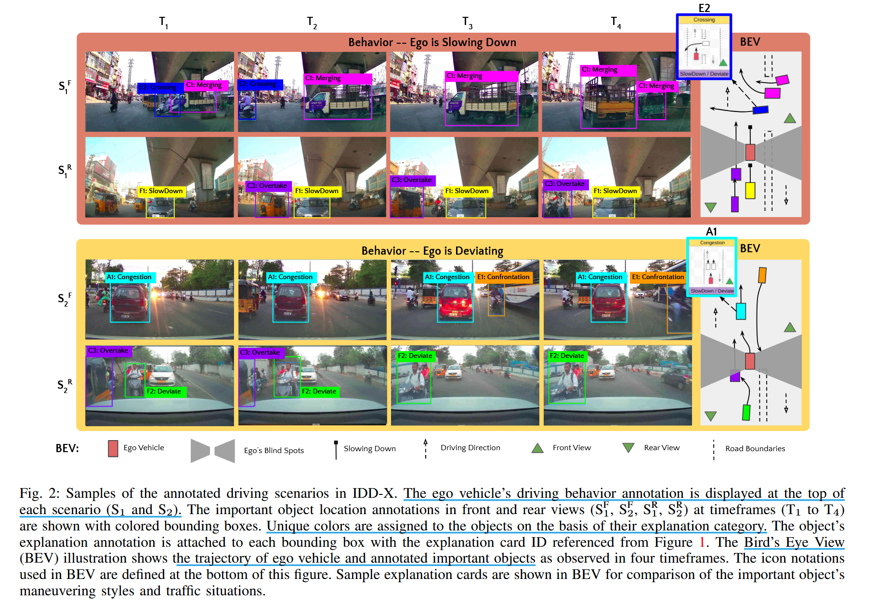

# IDD-X: A Multi-View Dataset for Ego-relative Important Object Localization and Explanation in Dense and Unstructured Traffic

## Introduction

### What is the main problem that this paper addresses? 

现有用于识别重要道路物体的数据集通常是在结构化且稀疏分布的场景，没有考虑密集、非结构化交通场景，即通常会出现多个重要的道路实体同时影响自我车辆的驾驶行为和一些非典型意想不到的行为。

### What are the main contributions of this paper?

- 引入 IDD-X 数据集，这是首个针对密集和无序交通场景的双视图驾驶视频数据集，双视图同时整合前视和后视视频，提供更全面的驾驶环境表示。

- 注解上提供详细的 ego-relative 注释，包括多个重要道路物体的定位和解释，覆盖 10 个物体类别（如车辆、行人等）和 19 个解释标签类别。并且在整个视频片段期间标注了自车的驾驶行为。

- 利用 IDD-X 数据集，引入新的网络架构去解决两个关键任务：(1) 多个重要对象定位， (2) 每个对象的解释预测

## Related works

## Dataset

## Tasks

