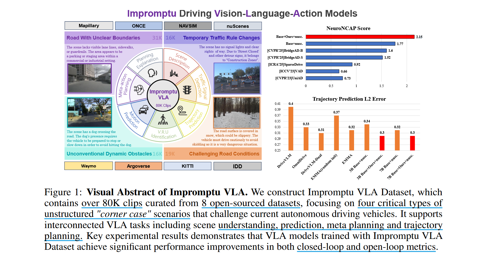

# Impromptu VLA: Open Weights and Open Data for Driving Vision-Language-Action Models

## What problem does this paper mainly address ?

- 现有 AD VLA 在非结构化的极端情况下表现不佳

## How does the paper address the above challenges?

- 提出 Impromptu VLA 数据集，超过 80,000 个视频片段，从来自 8 个开源大型数据集的超过 200 万个源剪辑中提炼出来

- 主要集中于四种非结构化场景：边界不明确的道路、临时交通规则的变化、非常规的动态障碍物和具有挑战性的路况

- 充分利用带有思维链的 vlm 进行细致理解，再进行人工验证以生成高质量、可靠的标签 

## Method

### Dataset consctuction

TODO

### Dataset Statistics

TODO

## Experiments
