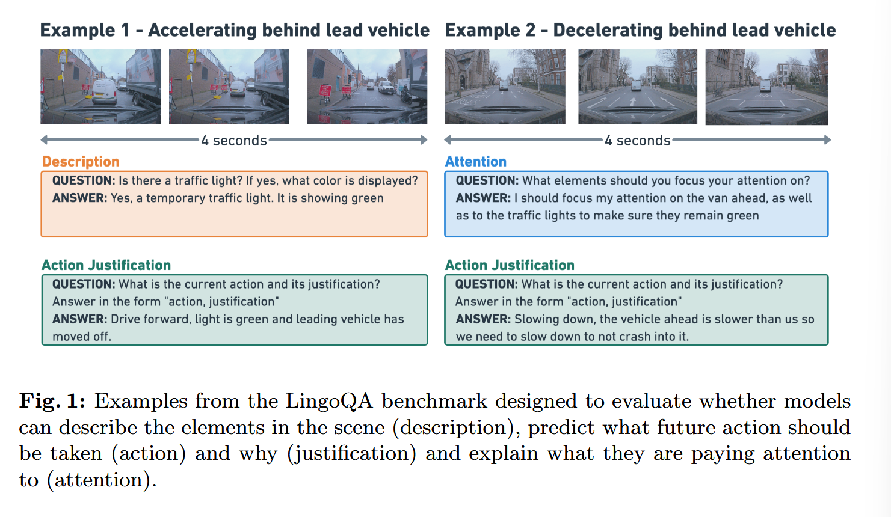
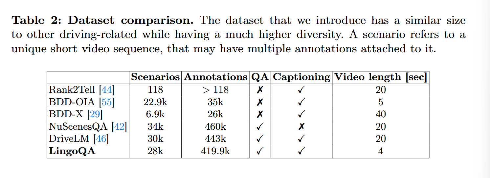
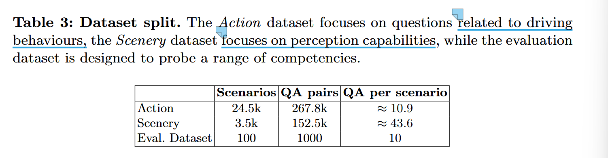
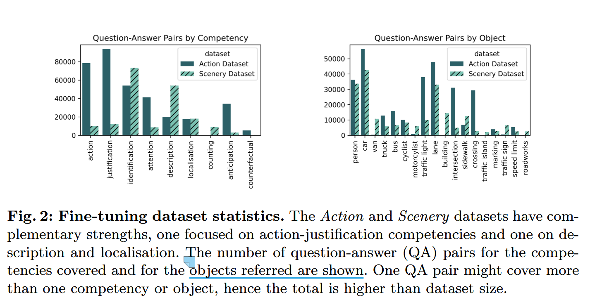
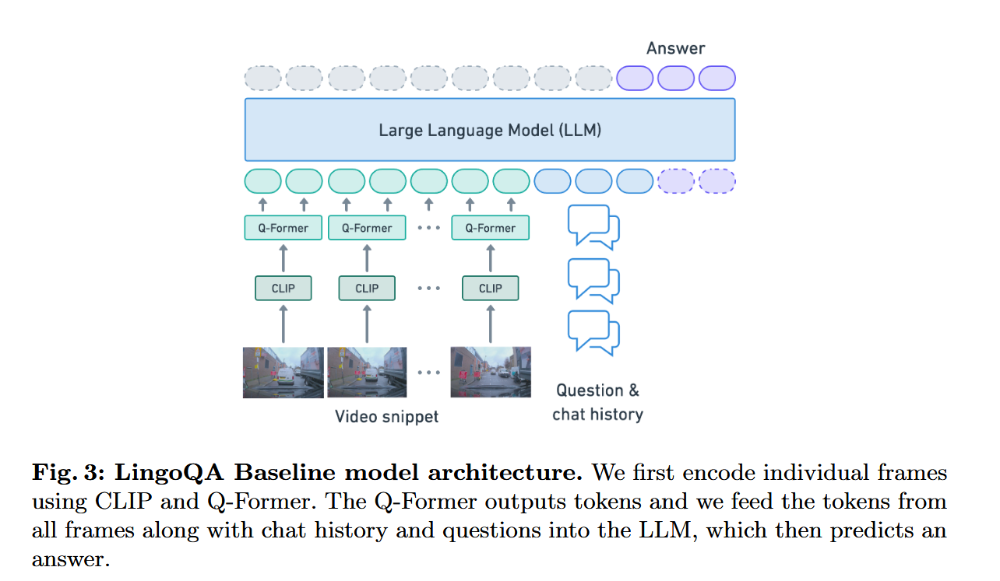
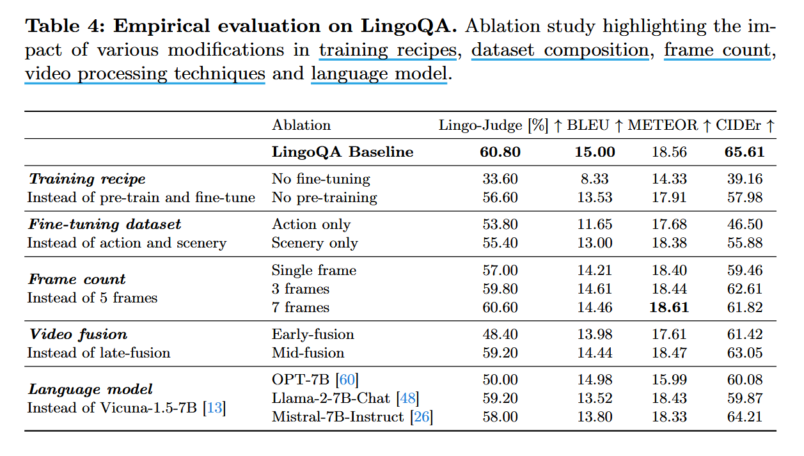
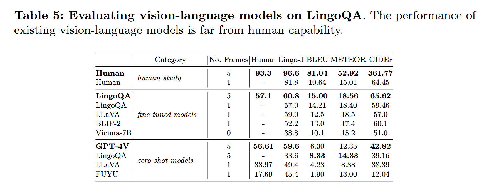

# LingoQA: Visual Question Answering for  Autonomous Driving

## What is the main contribution of this paper?

- **LingoQA Dataset**: 包含 419.9k QA pair, 问题和答案形式自由，覆盖感知和简单推理

- **LingoQA Benchmark**: 使用一个可学习的文本分类器用于评估，优于现存指标包括 GPT-4，与人类评估的 Spearman coefficient 为 0.950

> Spearman coefficient（斯皮尔曼相关系数）：用于衡量两个变量之间的单调关系（monotonic relationship），核心思想是不对原始数据进行计算，而是对数据的 “排名” 或 “等级” 及进行计算。

- **LingoQA Baseline**: 建立一个基线模型，

## LingoQA Benchmark

**LingoQA benchmark** 由一个自动的评估度量和对应用来微调和评估的数据集组成。

### Evaluation Metric

现有评估方式严重依赖于 n-gram frequency 而忽略了潜在的答案的语义。

TODO

### Datasets

LingoQA dataset 包含 419.9k QA pairs，单个样本包含 4-second video clip at 1HZ。

数据集包含两个部分：action dataset and scenery dataset。

**Action dataset** ：

- 根据记录的具有显著行为变化的驾驶场景创建的，场景注释由人工标注的高级描述和来自感知系统的原信息组成

- 场景注释经由 GPT3.5 处理生成对当前动作及其理由的描述，以及为预期的答案生产示例问题和提示

- 通过基于动作和行为的策略对事件进行分类来重新平衡事件，并从每个类别中采样多达 500 个事件，产生 24577 个视频片段和 167,774 个 QA pairs

**Scenery dataset** :

- 场景数据集被设计用于补充动作数据集，聚焦于细粒度感知相关问题

- 采用 ELAN video annotation software 注释  30-minute driving sessions，对 sessions 提供大约 15 个不同类别的 brief captions

- 注释每秒每帧收集一次以构建文本描述，再使用 GPT-4 生产对感知问题的一系列思维链，43 QA pairs per video 

**Dataset statistics** :

- 训练数据集涵盖了 9 中不同的能力：action, justification, attention, identification, localisation, description,counting, anticipation, reasoning given contuerfactuals

**Evaluation dataset**

- 收集一个人类反复标签、校正的数据集，以消除歧义

- 收集 1K high-quality answer 对应于 500 questions，每个问题有两个正确且多样的答案

### Model Methodology 

LLM 使用 Vicuna-v1.5-7B (based on Llama-2)，Vision encoder 使用 CLIP ，projector 使用 Q-Former。

分为两阶段训练：
  
  - 第一阶段训练 LLM 和 vision encoder 的自注意力层（即 QKV）以及所有 Q-Former 参数和线性语言投影以将视觉特征和 llm 的 embedding space 对齐
  - 第二阶段微调与前一阶段相同的参数，但保持视觉编码器冻结以进一步微调

## Experiments

### Ablation Studies on LingoQA 

由于 VLMs 的高度模块化，留下了一个问题：LingoQA 基准模型的哪些架构组件和数据集组合对其性能贡献最大？

**training recipe** and **dataset mixture**：
- 预训练（这里通用 QAs 对训练）和微调对性能影响程度：微调带来的性能提高是预训练的两倍 
- Action Dataset 和 Scenery Dataset 都对模型性能提高有影响

**Frame Count**:
- 从多帧图像递减到单帧图像时，性能下降，但仍然接近多帧基线，表明可以从单帧解决一定比例的自动驾驶场景

**Video Fusion Strategy**: 探索了整合图像帧到 LLM 的不同情形，研究表明 *mid-fusion* 和 *late-fusion* 更为有效
- *early-fusion*：在将特征送入 Q-Former 之前，采用平均池化来压缩视觉编码器的特征，从而为语言空间投影生成一个统一的视觉特征向量
- *mid-fusion*：在 Q-Former 内部，通过交叉注意力机制将视频特征融合成固定大小的令牌
- *late-fusion*：将 Q-Former 输出的单个帧嵌入（frame embedding）直接输入到大语言模型中

**Large Language Model**：
- 研究比较了 Vicuna-1.5-7B, Llama2-7B, Mistral-7B, OPT-7B
- 性能：Vicuna-1.5-7B > Llama2-7B > Mistral-7B > OPT-7B
- OPT-7B 性能最差可能是因为嵌入层维度比较小，只有 1048 相比其他模型的 4096

_

### Evaluation of SOTA Vision-Language Models

为证明新基准与人类评估的相关性，评估了一系列 SOTA VLM 并和人类表现相比较：

**Human study**: 在多帧和单帧输入上进行了评估
- 与多帧相比，单帧表现从 96.6% 下降到 81.8%
- 单帧主要失效的模式包括：将停放的车辆误判为行驶车辆，在多个视频帧中对摩托车手和行人等动态发展的危险目标计数错误，遗漏交通信号灯的状态变化，以及在跟车时未能预测出正确的速度。因此改进单帧推理也是至关重要的

**Fine-tuned models**：
- 我们发现 LLaVA 和人类在单帧图像表现有 23% 的差距
- LLaVA 性能好于 BLIP-2，认为是因为 LLaVA 使用了更大的 CLIP crop size (336) 与 BLIP-2(224) 相比

**Zero-shot models**：
- 最好的 zero-shot model GPT-4V 表现与人类表现有 37% 的差距
- LingoJudge 准确率受模型回复风格影响，像 FUYU 一样，冗长的错误答案可能会得到很高的评分

## Discussion and Limitations

**Strengths of Lingo-Judge**：与人类评估高度一致且推理高效

**Limitations of Lingo-Judge**：
- 仅适用于 LigoQA benchmark，不能泛化到其他类型问题
  
**Dataset and mdoel limitation**：
- 数据集相比之下包含更少的视频帧
- 仅包含单一模态，没有考虑多模态如点云 LiDAR 等

## TODO

1. Vicuna: An open-source chatbot impressing gpt-4 with 90%* chatgpt quality

2. Blip-2: Bootstrapping language-image pretraining with frozen image encoders and large language models

3. CLIP：Learning transferable visual models from natural language supervision 

