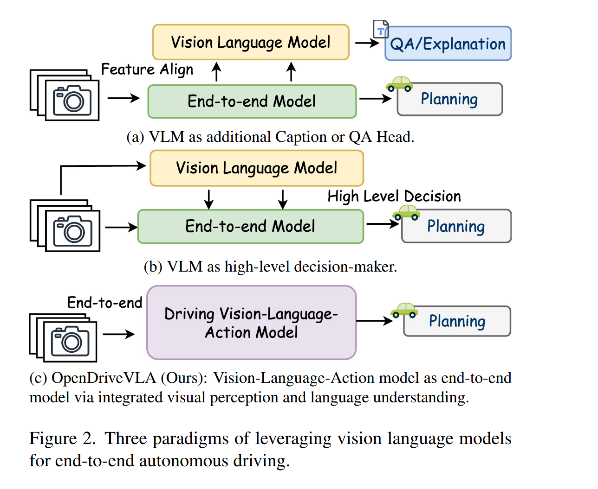
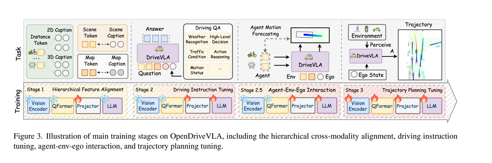
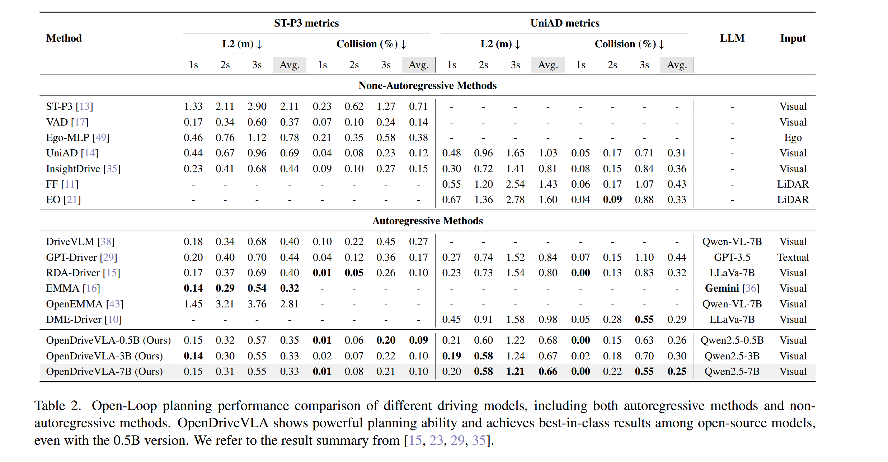
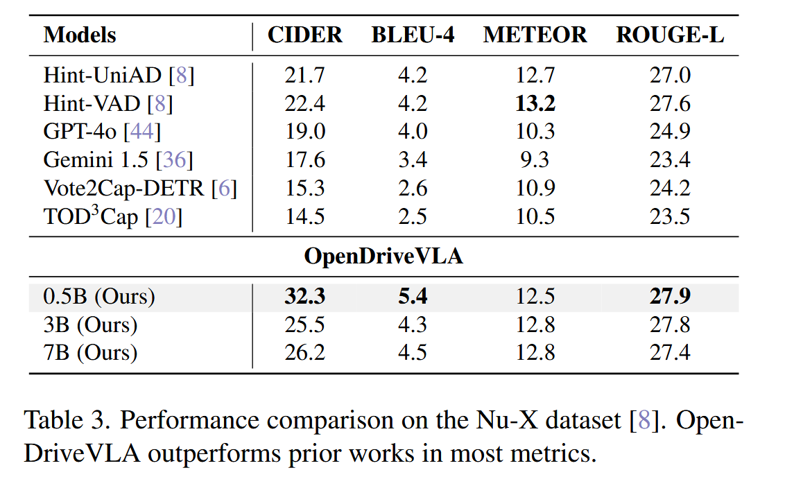

# OpenDriveVLA: Towards End-to-end Autonomous Driving with  Large Vision Language Action Model

## Introduction

现有 end-to-end 驾驶方法面临关键挑战 :

- 长尾场景中泛化能力不足

- 难以理解复杂场景中的高级语义

- 驾驶推理的不灵活

现有 end-to-end 自动驾驶的设计策略 ：

现有 VLMs 的自动驾驶中的挑战 :

- 当前 VLMs 主要针对静态 2D image-language 任务优化，在 3D 场景中空间推理能力不足

- 模型的幻觉输出，不正确或过度自信的描述 

> open-loop planning（开环规划）: 一种不依赖执行反馈的规划方式，即做出计划或决策后，不再根据环境的变化或过去的执行结果来调整决策
>
> in-context learning (ICL)：大模型在不更新参数的情况下，仅通过观察提示中的几个示例就学会了如何完成任务的能力   
>  

## Model

### architecture

- pre-trained vision encoder : 从多视角图像中提取环境表示

- cross-modal learning : 将视觉标记对齐到文本域

- driving instruction tuning : 通过 agent-ego-environment 交互建模

- end-to-end 训练去预测车辆轨迹

### 3D visual environmental perception

- 给定一组多视角图像，使用一个共享的 2D 主干网络提取多尺度二维特征 

- 在多个视角之间聚合，并投影的 BEV 空间中，从而生成 BEV 特征，$f_bev$

- 使用三种视觉查询模块来获得环境表示，global scene sampler $v_scene$, agent query_transformer $v_agent$, map query_transformer $v_map$

- 通过以视觉为中心的感知任务，包括三维检测、目标跟踪和图像分割来训练使其生成结构化环境 token , 即 $V_enc = {v_scene, v_agent, v_map}$

> BEV(Bird's Eye View) : 即鸟瞰图视角，将摄像头图像中的特征统一投影到地面坐标系

### hierarchical vision-language alignment 

- 对从 3D 感知模块中提取出的视觉 token，引入三个 token-specific projectores ${\Phi_scene, \Phi_agent, \Phi_map }$

- 训练时，$v_agent$ 会与对应的真实语言描述（包含二位外观描述、三维空间位置信息）进行匹配，

- $v_scene$、$v_map$，进行 sample-wise 描述对齐，分别编码全局空间上下文和静态结构属性

### driving instruction tuning 

- 通过驾驶指令微调将驾驶知识提炼到模型中，不采用显示 CoT，以实现推理速度和推理效率之间的权衡

- 使用 driving instruction QA dataset 进行微调，这些数据集涵盖了一系列驾驶相关的推理

### agent environment ego interaction

- 引入一个 conditional agent motion forecasting task 代理学习去解决现有大模型在 2D vision-language 上训练造成的偏差

- 在已知 scene、map tokens，与 ego vehicle state $S_ego$条件下，让 LLM 根据每个 agent 的投影视觉特征去预测未来的运动轨迹

- agent 的未来运动用一系列 waypoints 表示

> waypoint （航路点/路径点）: 一系列位置坐标，用于描述一个运动目标在未来某段时间内预期要经过的位置序列 

### end-to-end trajectory planning

- 先将路径点用 tokenizer 转换为离散的文本 token 序列

- 然后再将轨迹生成任务转化为一个因果序列的预测任务

 
  
## Experiments

### train data 

采用 nuScenes 数据集

### vision-language alignment

- agent：后处理 instance caption from Tod3cap，提供单个对象的 2D 视觉描述以及目标对应的 BEV 坐标

- scene token : 处理 multi-view scene 描述遵循 Lidar-llm，并合并为统一描述 

- map token : 从 ground-truth 注释中推导结构化语言描述

### driving instruction tuning 

- 采用多个从 nnScenes 派生的面向指令的数据集，统一为基于指令的 QA 格式

- 每个 QA 对都以结构化环境视觉 token 和自我车辆状态为条件，以确保一致性

### motion forecasting and trajectory prediction 

- 规划 ego vehicle 的未来路径和其他 agent 的未来轨迹，都采用 local coordinate

- 预测未来 3s 轨迹，每 0.5s 间隔采样，总共 6 waypoints

> local coordinate（局部坐标系）: 相对于某个特定对象建立的坐标系统
>
> global coordinate（全局坐标）：再整个环境中统一定义的参考坐标系，所有物体的位置都用这个系统来描述

### evaluations

- open-loop planning task on nuScenes benchmark ，评估第 1 秒、第 2 秒和第 3 秒的 L2 位移误差，以及在整个预测时间段内的平均碰撞率

- 在 driving instruction tuning 后直接在 VQA 上评估场景理解能力，采用 BLEU, METEOR, CIDEr, BERT-Score 等

> average collision rate ：用来衡量模型预测轨迹是否会导致车辆与其他目标发生碰撞

### implementation details

- 3D visual perception module 以 ResNet-101 作为骨干进行 2D 特征提取，在 3D 目标检测、目标追踪和地图分割进行多任务学习，生成空间分辨率为 $$200 \times 200$$ 的 BEV 特征图 

- scence token : global SceneSampler 应用二维自适应池化，将各视角池化后的特征拼接起来，形成一个 global scene token

- agent token & map token : 从各自的 Query Transformer 的最后一层中提取出来

- 每种类型的 token 通过一个独立的两层 MLP 进行映射，使用 GeLU 激活函数投影到语言空间

- LLM 采用 Qwen2.5-Instruct，训练时进行全参数微调 

> object tracking ：在连续的图像帧中，对已检测到的物体进行跨时间的身份保持与位置预测
>
> map segmentation ：对道路场景中的不同区域进行像素级别或区域级别的语义分割
>
> adaptive pooling ：不需要提前指定池化窗口大小，会自动调整池化窗口大小和步长，是输入被均匀划分，最终输出固定大小的特征图。

### main results 

> ST-P3 (Spatio-Temporal Planning Prediction Protocol)：一个统一的评估协议，用于评估联合的轨迹预测 + 规划输出在自动驾驶场景中表现
>
> UniAD (Unified Autonomous Driving): 既是一个自动驾驶任务的统一框架也是一个大规模评估基础，把感知、预测、规划多个任务统一在一个 pipeline 中进行评估

- 自我状态信息在轨迹预测中起着重要作用

- 由于数据存在分布不平衡问题，大量场景都是维持当前状态，模型因此过度依赖 ego-state history，导致模型在预测时倾向于保守决策

