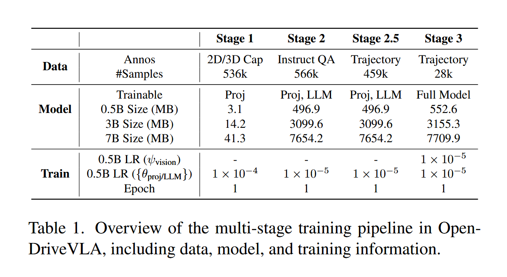

# OpenDriveVLA: Towards End-to-end Autonomous Driving with  Large Vision Language Action Model

## Introduction

## Model

## Experiments

### train data 

采用 nuScenes 数据集

### vision-language alignment

- agent：后处理 instance caption from Tod3cap，提供单个对象的 2D 视觉描述以及目标对应的 BEV 坐标

- scene token : 处理 multi-view scene 描述遵循 Lidar-llm，并合并为统一描述 

- map token : 从 ground-truth 注释中推导结构化语言描述

### driving instruction tuning 

### motion forecasting and trajectory prediction 

