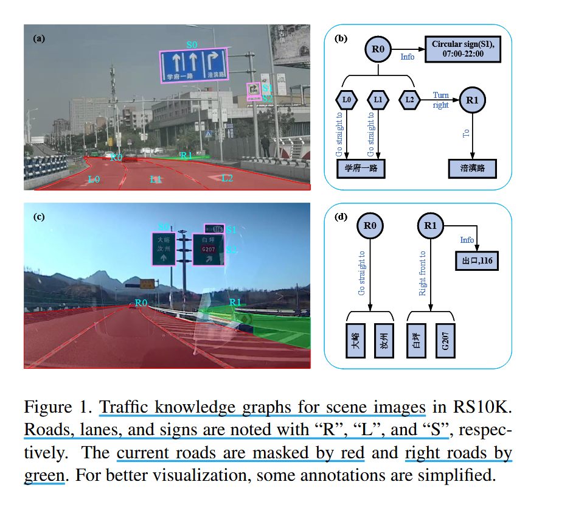

# Visual Traffic Knowledge Graph Generation from Scene Images

## Induction

###  What is the main problem addressed by this paper? 

过去的交通场景理解大多停留在道路分割、车道检测等低层次感知阶段，很少涉及到高层次的理解。

### What approach is used in this paper to address the issue?

- 引入具有详细注释的 CASIA-Tecent Road dataset (RS10K)

- 定义了 Visual Traffic Knowledge Graph Generation (VTKGG) 任务，在位置已知的交通标志、道路和车道上进行场景理解并提供全面、格式良好的交通场景信息

- 提出一种包含层次图注意网络（Hierarchical Graph ATention network, HGAT）的新型交通场景分析架构，用于分析交通场景图中的异构元素

> heterogeneous elements（异构元素）: 通常指类型不同、结构不同、语义不同的多个组成部分。 

**Different relative**

- S-S relation : 交通标志间的关系，暗含一个标志是另一个标志的补充

- C-C relation : 组件间的关系，“组件”（Component）指的是交通标志内部的细粒度元素或组成部分

- C-T relation : 组件与交通元素间的关系

 
## Dataset

## Approach

## Experiments

